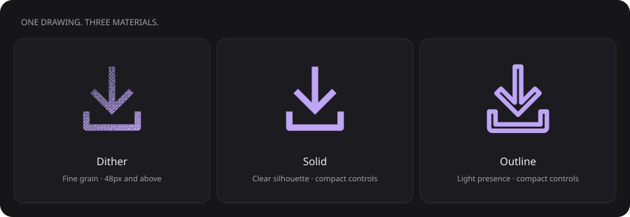
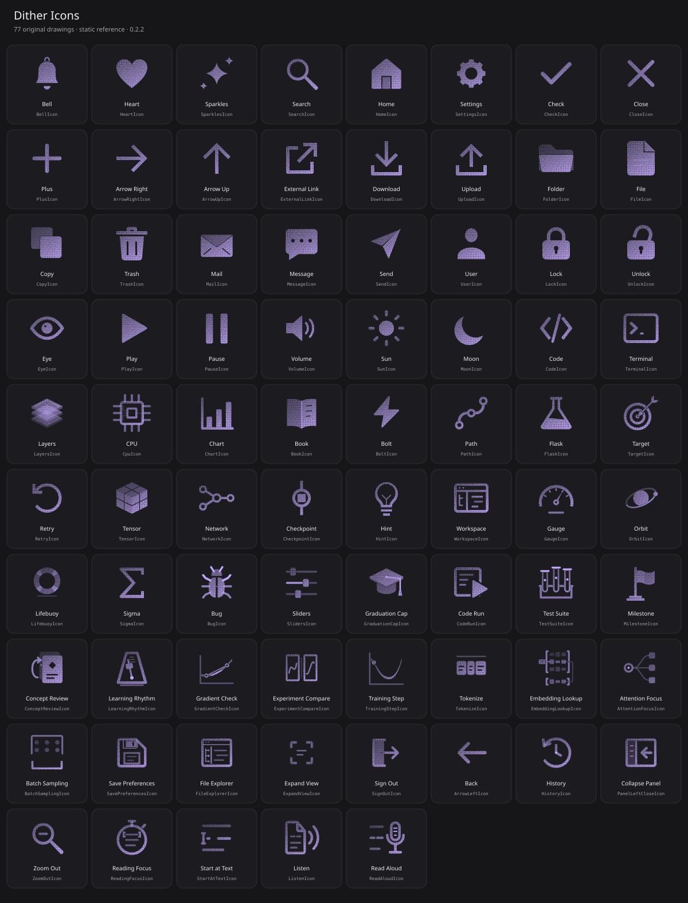

# Dither Icons

**A little grain. A lot of character.**

68 original animated SVG icons for React. Clean vector contours, fine ordered dither, and a small gesture that belongs to each icon: a bell rings, a tray catches, a lid opens.

[Get started](#get-started) · [Documentation](public/docs/introduction.md) · [For AI agents](AI.md) · [Contributing](CONTRIBUTING.md) · [MIT license](LICENSE)



## Made for the little details

- **Three materials.** Dither, solid and outline share the same original geometry in a 24 × 24 viewBox.
- **Individual motion.** Every icon has an authored gesture. Semantic parts move together; the grain stays attached to its surface.
- **Real interactions.** Hover, keyboard focus and tap play once. React playback finishes after you leave and ignores overlapping triggers.
- **Accessible by default.** Reduced motion is respected. Decorative icons stay out of the accessibility tree; meaningful images can have a title.
- **Your interface, your color.** Icons inherit `currentColor`. The gallery includes eight curated palettes with light and dark variants.
- **React or SVG.** Typed components, forwarded SVG refs and standalone SVG export. No separate stylesheet or animation dependency.
- **Context for your agent.** An exact export manifest, integration guide and labeled visual references ship alongside the code.

<details>
<summary>See all 68 icons</summary>



Browse the [machine-readable collection](icons.json) or the [individual motion catalog](docs/MOTION-CATALOG.md).

</details>

## Get started

Node.js 22+ is recommended for development. React 18+ is the library's only peer dependency.

```sh
git clone https://github.com/vijayksingh/dither-icons.git
cd dither-icons
npm ci
npm run dev
```

Open **http://127.0.0.1:4192** to explore the gallery. Hover or tap a preview to play it; select the name to open its page. Customize the material, color and size, then copy React or download an SVG.

| Local page | What you can do |
| --- | --- |
| `/` | Search and explore the collection |
| `/icons/download` | Preview, inspect timing, copy source and export one icon |
| `/motion` | Compare gestures, play at half speed and inspect individual frames |
| `/docs` | Read installation, API, motion, accessibility and SVG guides |
| `/ai` | Build integration instructions and download agent context |

**Cmd/Ctrl-K** searches pages and icons. **/** focuses the collection filter. Browser Back restores your filter, scroll position and focused icon.

## Use in your React app

The package is **not published to npm yet**. Create a local package from this checkout:

```sh
# Inside the dither-icons checkout, after npm ci:
npm pack

# Inside your application, use the path to the generated file:
npm install /absolute/path/to/unlocalhosted-dither-icons-0.1.0.tgz
```

Import a named component and put the action on a real control:

```tsx
import { DownloadIcon } from '@unlocalhosted/dither-icons';

export function DownloadButton({ onDownload }: { onDownload: () => void }) {
  return (
    <button type="button" className="di-trigger" onClick={onDownload}>
      <DownloadIcon size={48} texture="dither" />
      <span>Download file</span>
    </button>
  );
}
```

`di-trigger` lets the whole control's hover, focus or tap trigger the icon. The visible text names this button; use `aria-label` for an icon-only control. Your application owns the action, loading state and result. The gesture never substitutes for confirmation that an operation succeeded.

### Choose a material

| Material | Suggested use |
| --- | --- |
| `dither` | Expressive detail at 48px and above |
| `solid` | Clear silhouettes in compact 16–24px controls |
| `outline` | A lighter presence in toolbars and navigation |

The texture sits inside a smooth vector silhouette. Color comes from the surrounding interface; check contrast at the size you actually use.

### Component API

All components accept ordinary SVG props and forward an SVG ref.

| Prop | Default | Behavior |
| --- | --- | --- |
| `size` | `24` | Width and height; number or CSS-compatible string |
| `texture` | `dither` | `dither`, `solid` or `outline` |
| `animate` | `true` | Enable interaction-triggered motion |
| `active` | `false` | Play when this becomes true; reset false before a later trigger |
| `replayKey` | `0` | Change the value to request another playback |
| `speed` | `1` | Positive playback rate; `0.5` is half speed |
| `progress` | — | Pause at a normalized frame from `0` to `1`; omit to resume interaction |
| `title` | — | Name a meaningful SVG image; otherwise it is decorative |

For runtime selection, use `DitherIcon` with a valid `name` from [icons.json](icons.json). Invalid names throw a descriptive error. See the [complete React guide](public/docs/react.md) for examples.

### Motion and SVG behavior

React uses the native Web Animations API. Each gesture returns to rest, completes after pointer departure, and cancels on unmount, motion-off or a reduced-motion preference change. `animate={false}` takes precedence over active playback.

Standalone SVGs contain the same tracks compiled to CSS, including reduced-motion rules. Inline the **complete SVG**, including its styles, masks and internal definitions, for hover playback. An `` embedding is static. CSS hover playback ends when hover ends; use React when the gesture should finish after pointer departure. Keep internal IDs unique when combining exported SVGs in one document.

ESM and TypeScript declarations are included. Named exports currently share the complete geometry catalog; per-icon bundle splitting is not implemented.

## Documentation and AI context

| Guide | Contents |
| --- | --- |
| [Introduction](public/docs/introduction.md) | First icon, materials and library behavior |
| [Installation](public/docs/installation.md) | Local package, React environments and SVG use |
| [React API](public/docs/react.md) | Props, named exports, dynamic selection and replay |
| [Motion](public/docs/motion.md) | Semantic gestures, triggers and frame inspection |
| [Accessibility](public/docs/accessibility.md) | Labels, keyboard interaction, state and reduced motion |
| [SVG export](public/docs/svg.md) | Complete markup, styling and playback limitations |

Give your coding agent [AI.md](AI.md) and [icons.json](icons.json). Together they describe the real exports, their meaning and the integration contract. For more context, use the [complete text guide](public/llms-full.txt), [material sheet](public/reference/textures.svg) and [labeled collection](public/reference/icons.svg).

The local site also serves `/llms.txt` and an instruction builder at `/ai`. Download the files when working with a remote agent that cannot reach your local preview.

## Development

```sh
npm run typecheck     # TypeScript
npm test              # Geometry, choreography, exports and documentation checks
npm run build         # React package, downloadable tarball and public site
npm run generate:docs # Regenerate guides, manifest and visual references
```

| Directory | Purpose |
| --- | --- |
| `src/` | Original artwork, React components and motion engine |
| `src/motions/` | Individually authored icon timelines |
| `demo/` | Gallery, icon pages, motion studio and documentation UI |
| `demo/content/` | Shared source for web guides and generated Markdown |
| `public/` | Agent context, static references and downloadable guides |
| `docs/` | Design principles, individual reviews and browser evidence |
| `tests/` | Geometry, motion, accessibility and export contracts |

`dist/` contains the built React package; `site-dist/` contains the built public site. Build and pack regenerate the documentation from the real exports. Edit `demo/content/docs.ts` and `demo/content/agent.ts`, then regenerate instead of hand-editing generated files.

Cloudflare Pages serves the generated route directories and provides its native SPA fallback. Do not add a catch-all rewrite that replaces route-specific HTML. See [Cloudflare deployment](docs/DEPLOYMENT.md) for the production settings. The React package is distributed as a download; a registry release is not yet available.

## Contributing

Contributions are welcome. Start with [CONTRIBUTING.md](CONTRIBUTING.md) and the [motion principles](docs/MOTION-PRINCIPLES.md).

For a new icon, begin with an actual interface action. Define its meaning, the silhouette that must remain readable, and the parts that cause each other to move. Refine one gesture before repeating an approach across the library. Include real browser evidence for visual or motion changes.

[Report a bug or propose an icon](https://github.com/vijayksingh/dither-icons/issues).

## Credits and license

Created by [Vijay Singh](https://github.com/vijayksingh) / Unlocalhosted. Find me on [Twitter / X](https://twitter.com/dprophecyguy) and [LinkedIn](https://www.linkedin.com/in/iamvijaysingh/). The public browsing experience takes inspiration from [lucide-animated](https://lucide-animated.com/) and [transitions.dev](https://transitions.dev/). The icon geometry and implementation are original; reference branding, assets and source are not included.

[MIT](LICENSE) — free to use, modify and distribute, including in commercial projects. Retain the license notice.

## Social previews

The production build generates 1200 × 630 PNG previews and crawler-readable HTML for the home page, guides, motion studio, AI page, and all 68 icons. Share an icon URL to show that icon in the preview. Open Graph and Twitter card metadata are present in the initial HTML; crawlers do not need JavaScript.

The canonical origin defaults to `https://dithered.dev`. To build for another origin:

```sh
SITE_URL=https://your-domain.example npm run build
```

Deploy the complete `site-dist/` directory, including route directories and `og/`. Existing files must take precedence over the SPA fallback. Social networks can cache previews; publishing a build does not invalidate their caches. No deployment is performed by `npm run build`.

`npm run generate:social` regenerates just the images from the original artwork. Their bundled DM Sans font is licensed under the [SIL Open Font License](scripts/assets/OFL-DM-Sans.txt). Preview metadata follows the [Open Graph specification](https://ogp.me/).
