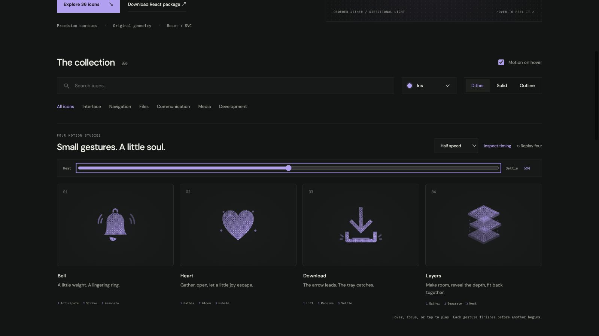

# Four motion studies — 2026-09-08

Scope: bell, heart, download, layers. The remaining 32 icons retain their prior motion presets. User accepted the richer interaction direction, then required download to retain its identity; its arrow now stays visible throughout.

## Motion decisions

| Icon | Choreography | Identity constraint |
| --- | --- | --- |
| Bell | 100ms anticipation, shell swing, delayed clapper, alternating ring cues, 940ms settle | Shell and clapper remain visible; their pivots and response are independent |
| Heart | 130ms compression, elastic release, brief lobe highlight, four small flecks, 820ms settle | Heart contour remains the main visual throughout |
| Download | 170ms lift, fall, 460ms receiving-tray impact, brief highlight and side accents, 1120ms settle | Arrow and tray remain fully opaque; no checkmark substitution |
| Layers | Compression, independent plane separation, readable hold, staggered nesting, 1120ms settle | Three planes preserve their order and return to the original stack |

Timing, origins, easing, and tracks are centralized in `src/choreography.ts`. React uses native Web Animations; inline SVG carries CSS generated from the same tracks. Only transform and opacity animate. React playback completes after hover/focus leave; repeated triggers during a performance are ignored. Cleanup cancels tracks on unmount, motion-off, and reduced-motion changes. Standalone CSS hover cannot continue after hover ends; the stronger lifecycle belongs to React.

## Review evidence

The gallery exposes actual speed, half speed, replay, and an optional keyboard-accessible frame scrubber. They operate on the production tracks rather than a separate mock animation.

Inspected in the live browser:

- 30%: bell shell and clapper rotate in opposite directions; first ring cue visible; heart expands; layers separate.
- 50% after the identity correction: download arrow and tray both have computed opacity 1; receiving highlight and impact cues visible.
- 100%: every visible identity part has identity transform; all transient accents have opacity 0.
- Real half-speed playback: bell remains playing after keyboard focus moves to heart; both complete and remove their playing state.
- Reduced motion: all four return to untransformed static artwork, including while scrubbing.
- Motion off: clicking a study starts no animation; Replay four is disabled.
- Light and dark palettes remain available. Narrow layout measured 390px client and scroll width, with two 173px study columns; no horizontal overflow.
- Console: no application errors during final checks.

Typecheck, nine targeted tests, library/type-declaration build, packaged gallery build, and a fresh tarball consumer SSR import all passed. Tests bind every timeline track to a real SVG part, enforce monotonic timing and neutral endings, preserve download opacity, and check standalone reduced-motion CSS.
