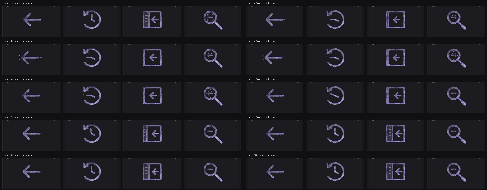

# Back: Interface Craft review

## Context
Return navigation. The Workspace and Discussions headers already use ArrowLeft on links to Dashboard (CraftingAttention `app/src/routes/workspace.tsx:61`, `app/src/routes/discussions.$unitId.tsx:42`).

## First Impressions
A left arrow already communicates the action. The motion should reinforce returning one step without inventing another mechanical device or replacing its directional shape.

## Visual Design
One rounded contour forms the shaft and head. The full arrow remains legible while moving 1.65 units left; its stroke and response clear the 24-unit viewBox. A short trace on the right identifies the point left behind. Dither fills the smooth stroke rather than dictating its shape.

## Interface Design
Brief take-up precedes the return. The trace grows only as the arrow leaves it. Two fine arrival marks follow the leftward stop, then decay while the arrow holds. The trace does not move with the arrow because it represents the prior location.

## Consistency & Conventions
MOT-01/03/05/07/08/15/16 guide identity, relationships, material and the semantic finish. MOT-09/10/11/12 preserve complete finite playback, exact rest, stillness and shared export timing. MOT-14 leaves application state to the host. Future platform use follows UI-2/4, COLOR-2/5, A11Y-2/4 and MOTION-1/4/6/7.

## User Context
The host link owns routing. The animation does not navigate, remove history or imply that a route loaded. Keep the label Back or the actual destination; still solid/outline is preferable for frequently repeated compact navigation.

## Top Opportunities
Keep one clear directional stroke; make the departure trace refer to the old location; reserve the response for arrival.

## Encoded storyboard and review
[Timing source](../../src/motions/arrow-left.ts). 1140ms. Take-up 110ms; departure trace from 200ms; arrive at 370ms; response at 440ms; hold to 670ms; clear at 820ms; home at 1020ms. Actors: back-arrow, back-trace, back-arrival.

Native playback shows a short deliberate return, with the old-location trace and destination marks appearing in order. The full arrow stays readable in every inspected pose and at 24px. Reviewed seven poses, actual-speed keyboard completion, native half-speed playback, three materials, light Cobalt/dark Iris, reduced motion, motion off, narrow layout and compact standalone SVGs. [Evidence and limits](../motion-evidence/platform-09/README.md). Implementation and rendered review are complete; user acceptance is pending.

