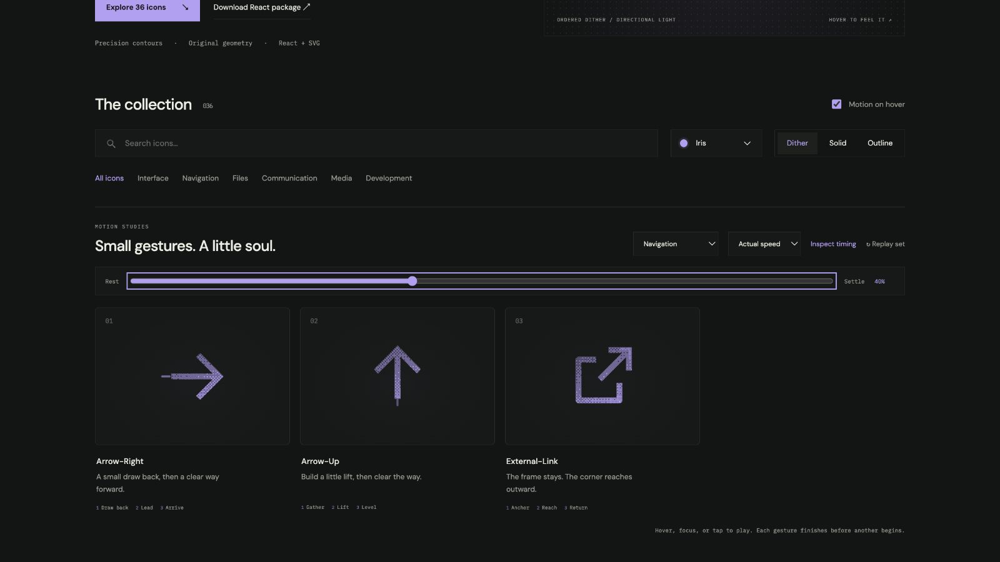

# arrow-right: Interface Craft review

## Context
An SVG action icon in a reusable developer library. Its semantic meaning is **continue or advance horizontally**. It appears in routine controls where recognition matters more than spectacle.

## First Impressions
The earlier whole-arrow slide showed direction but had no intentional arrival.

## Visual Design
**Identity boundary** — Keep the complete right-pointing arrow inside the viewBox. Stable dither follows the contour. Color inherits the selected palette; accents use the same ink and stay below the primary silhouette in visual weight. Typography and card framing belong to the shared inspector, not the glyph.

## Interface Design
The missed opportunity is to express **continue or advance horizontally** through a causal gesture. A short backward preparation precedes a rightward lead; a small tail cue dissipates. The inspector exposes replay and timing only when requested; the icon itself adds no controls or labels.

## Consistency & Conventions
Retain the conventional glyph. Use the shared hover, focus, click, reduced-motion, and completion contracts. MOT-01, MOT-02, MOT-03, MOT-04, MOT-05, MOT-08, MOT-09, MOT-10, MOT-11, MOT-12, MOT-14, MOT-15 apply.

## User Context
No looping travel: navigation must feel deliberate, not impatient. Recognizability must survive a brief glance and the still-motion variant.

## Top Opportunities
1. A short backward preparation precedes a rightward lead; a small tail cue dissipates.
2. Keep the complete right-pointing arrow inside the viewBox.
3. No looping travel: navigation must feel deliberate, not impatient.

## Encoded storyboard and review

**Duration:** 780ms. **Sequence:** Draw back / Lead / Arrive.

Timing source: [navigation.ts](../../src/motions/navigation.ts). Geometry binds each named track in `CraftedArtwork.tsx` or `ExtendedArtwork.tsx`. Times below are milliseconds from the same clock; transform values, pivots and easing live in that source.

| Named part | Keyframe times (ms) |
| --- | --- |
| `arrow` | 0, 110, 300, 470, 640, 780 |
| `tail-light` | 0, 160, 330, 580, 780 |

**Rendered review:** The arrow retains its direction through draw-back and reach. The tail cue is smaller and lighter; it fades before arrival.

Reviewed at preparation (20%), action (40%), recovery (70%) and neutral endpoint (100%), with actual playback and per-part endpoint inspection in the live gallery. These samples establish the reviewed poses; they do not replace the full timeline or the shared lifecycle checks in [VALIDATION.md](../VALIDATION.md).

**Visual reference:** icon 1 from the left in this family.

[Preparation image](../motion-evidence/rollout/navigation-prepare.png) · [Recovery image](../motion-evidence/rollout/navigation-recover.png)
