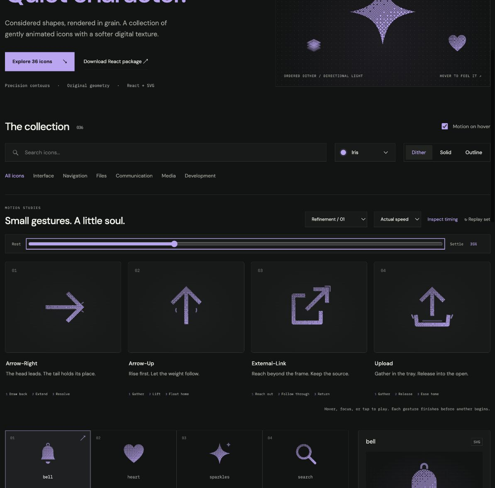

# arrow-up: Interface Craft refinement 01

## Context
**Meaning:** rise or move toward the top. An upward navigation symbol, with no promise of a transfer. This review replaces its earlier rollout assessment.

## First Impressions
The old whole-arrow rise and lower tick showed direction but had little sense of weight. The first refined version gained a joined stem but still lacked the payoff the user liked in Download.

## Visual Design
The head leads while the foot initially stays behind. The stem length responds to those two endpoints, so the glyph stretches continuously without a detached chevron. The foot then catches up during the float. Two fine curved updrafts appear below the passing shoulders; they travel a little upward and disappear. They do not form a halo above the tip or a second arrow.

Outline contour caps were rounded after rendered review exposed small gaps where the stem and head met. The material retains its stable grain throughout.

## Interface Design
A 150ms downward gathering precedes the rise. The head reaches its high point at 370ms, the updraft peaks at 410ms, and the foot catches up at 540ms. The weight returns before the head fully settles. This is a single rise with a distinct crest, rather than an idle bob.

## Consistency & Conventions
MOT-01–13, MOT-14, MOT-15, MOT-16. Arrow direction and both arms remain visible. The slower float distinguishes it from arrow-right's tension and upload's source release. Shared keyboard/click/reduced-motion behavior and CSS export limitations remain in effect.

## User Context
Upward motion can mean navigation, elevation, or returning to the top. Avoid rocket imagery, disappearing glyphs, or a completion state. The 1120ms study gives the weight time to catch up while remaining a single finite gesture.

## Top Opportunities addressed
1. Give ascent a leading head and lagging foot.
2. Make the crest perceptible through small updrafts behind the head.
3. Keep the stem connected and the return weighted without a long oscillation.

## Encoded storyboard
Source: [arrowUp.ts](../../src/motions/arrowUp.ts). Named `TIMING`, `UP_STEM`, `HEAD`, `FOOT`, `WAKE`, and `EASING` expose the tuning. The moving foot and stem scale use the same interpolation as the head.

| Time | Action |
| --- | --- |
| 0–150ms | Head gathers 0.7 units downward. |
| 150–370ms | Head rises 1.85 units; foot lags. |
| 280–410ms | Updrafts appear behind the shoulders and crest. |
| 370–540ms | Foot follows; the head floats. |
| 410–730ms | Updrafts rise and dissipate. |
| 540–1120ms | Foot returns, then the head settles through 0.09 units. |

## Rendered review
Second icon from the left. Inspected at 0%, 10%, 35%, 70%, and 100%; actual and half-speed replay; all three materials. The updraft follows the lift, the foot catches up, and the icon returns with no lingering light. The split-contour gap was corrected. [Batch validation](../VALIDATION.md#focused-refinement-01--2026-09-09) records shared checks.

[Rest](../motion-evidence/refinement-01/rest.png) · [Preparation](../motion-evidence/refinement-01/prepare.png) · [Recovery](../motion-evidence/refinement-01/recover.png) · [Outline](../motion-evidence/refinement-01/outline.png)
