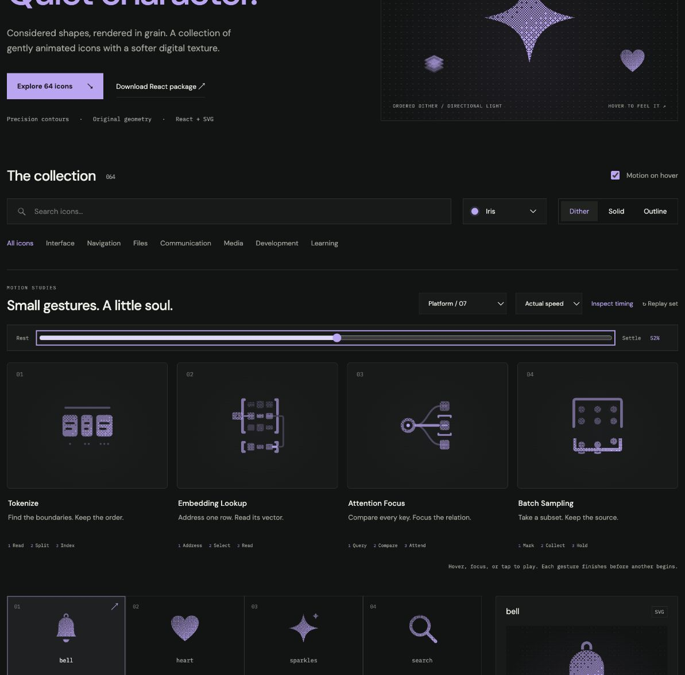

# Attention Focus: Interface Craft review

## Context

**Inspect a query’s relationships while emphasizing a stronger match.** `AttentionHeatmap.tsx:288–300` exposes query/key relations. `DictionaryLookupViz.tsx:7–16` explains that all unmasked values contribute, unlike hard lookup.

## First Impressions

One query lens and a fan of three key tiles should retain the sense of multiple relationships. Focus must not erase the other two keys.

## Visual Design

A fixed query ring, three curved/straight carriers and three key tiles. A close pair of corner marks frames the stronger middle relation. All links remain present.

**Identity boundary:** Three keys and all three links persist. The highlight is emphasis, not an argmax or hard selection.

## Interface Design

The query pupil gathers briefly. Signals compare all three keys in parallel. Only after all arrive does the middle relation gain a held focus response; the other relationships remain legible.

## Consistency & Conventions

MOT-01/02/03/05 preserve meaning, identity and causal references. MOT-07/08/16 require attached grain and a localized response. MOT-09–15 govern completed playback, exact rest, input/stillness, shared export timing and individual rendered review. Platform handoff: UI-2/4, COLOR-2/5, A11Y-2/4, MOTION-1/4/6/7.

## User Context

This is a labeled attention affordance, not a full softmax or value-aggregation model. Do not imply the other values stop contributing. Use native labeled controls. Keep small, frequently used icons still in solid/outline; dither benefits from 48px or larger. Keyboard, reduced motion and motion-off retain a complete static drawing.

## Top Opportunities

Keep all comparisons visible before emphasis, and distinguish the middle focus from an arbitrary network pulse.

## Encoded storyboard and review

**Query / Compare / Attend · 1460ms.** [attention-focus.ts](../../src/motions/attention-focus.ts) records the timestamp storyboard and named actors; [DataFlowArtwork.tsx](../../src/DataFlowArtwork.tsx) owns the geometry.

| Actor | Timing and attachment |
| --- | --- |
| Query pupil | Gathers at 120ms, releases at 200ms inside the fixed lens |
| Three comparison traces | Depart together at 200ms; each follows its actual carrier and reaches its key at 540ms |
| Key witnesses | All respond at 630ms with different emphasis |
| Stronger relation and frame | Peak 770ms, hold through 960ms, clear 1120ms |

All three relations stay visible while the middle gains emphasis. This is a focus affordance, not a hard lookup or a full attention calculation. The query ring remains fixed and the close framing supplies a restrained climax. The caption was shortened after rendered review to maintain the row's rhythm. Cubic carrier interpolation stays within .005 units.

Actual and half-speed playback reviewed through return. Eight reference poses at 0/10/20/38/52/62/82/100% have identical initial/final computed states. Dither, outline and solid retain the same 62% pose. Keyboard replay and Tab departure, reduced-motion cancellation, disabled motion, light/dark, compact sizes and narrow layout were inspected; details and limits are in [VALIDATION.md](../VALIDATION.md).

**Reference position: 3 of four.**

[Rest](../motion-evidence/platform-07/pose-0.png) · [Outline](../motion-evidence/platform-07/outline-62.png) · [Light solid](../motion-evidence/platform-07/light-solid-62.png)

This completed concept study is retained at the user's request. Future candidates must follow the platform interface selection policy in [PLATFORM-ICONS.md](../PLATFORM-ICONS.md).
