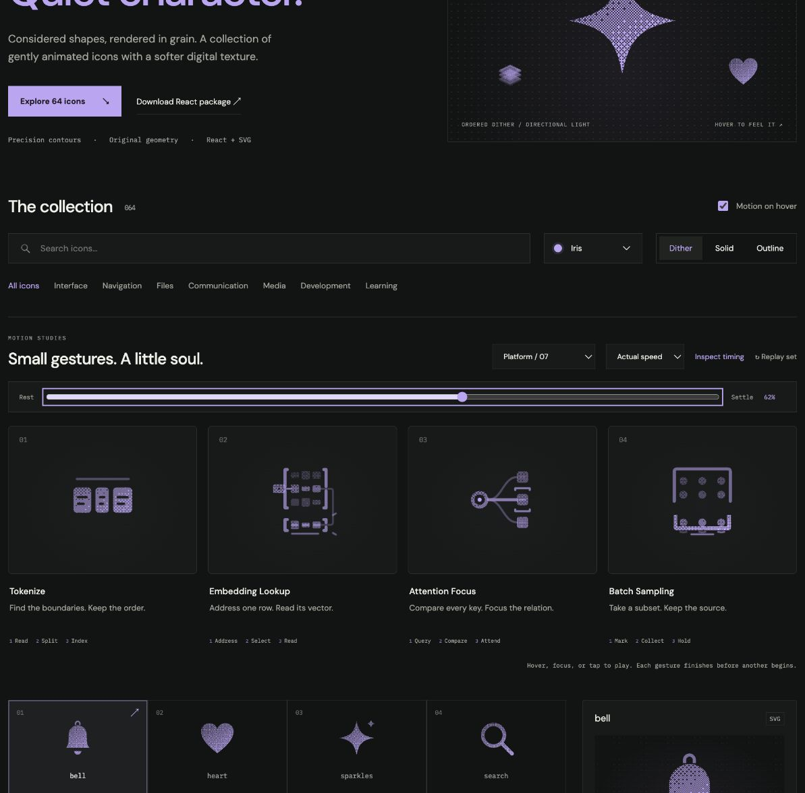

# Batch Sampling: Interface Craft review

## Context

**Read a subset while retaining the dataset.** `GradientBatchEstimatorViz.tsx:13–16,51–66` offers full, single and mini-batch row selections.

## First Impressions

A source grid above a receiving tray should show a subset of examples being collected without deleting source records.

## Visual Design

Six retained source samples, three copied samples and a fixed receiving tray. Moving copies occlude source cells only while passing in front. The tray’s actual floor is the contact plane.

**Identity boundary:** All six source records remain. Three copies preserve column identity and never pass through the receiving floor.

## Interface Design

Mark three source positions. Copies leave in a small stagger, seat on the tray floor and produce individual contact lights. A shared receipt waits for the final sample. Hold, fade the copies and restore the preview.

## Consistency & Conventions

MOT-01/02/03/05 preserve meaning, identity and causal references. MOT-07/08/16 require attached grain and a localized response. MOT-09–15 govern completed playback, exact rest, input/stillness, shared export timing and individual rendered review. Platform handoff: UI-2/4, COLOR-2/5, A11Y-2/4, MOTION-1/4/6/7.

## User Context

The preview does not choose real training data, commit an update or report a gradient result. Use native labeled controls. Keep small, frequently used icons still in solid/outline; dither benefits from 48px or larger. Keyboard, reduced motion and motion-off retain a complete static drawing.

## Top Opportunities

Make the batch response depend on all three arrivals; encode the difference between copying data and moving it.

## Encoded storyboard and review

**Mark / Collect / Hold · 1540ms.** [batch-sampling.ts](../../src/motions/batch-sampling.ts) records the timestamp storyboard and named actors; [DataFlowArtwork.tsx](../../src/DataFlowArtwork.tsx) owns the geometry.

| Actor | Timing and attachment |
| --- | --- |
| Source marks | Peak 150 / 250 / 350ms before copies depart |
| Three copies and occluders | Identical tracks; depart 260 / 360 / 460ms; contact 610 / 710 / 810ms |
| Individual seat lights | Answer 680 / 780 / 880ms after their respective contact |
| Shared receipt | Peak 940ms after the final arrival; copies held until 1100ms, fade in place by 1280ms, reset hidden by 1540ms |

All six source records remain present. Selected copies begin at actual source coordinates so their grain is complete. Their radius is 1.25 and final center y=19.25, giving exact contact with the real tray floor y=20.5 in filled and outline materials. The last arrival earns the shared receiving response; no source sample or dataset is deleted.

Actual and half-speed playback reviewed through return. Eight reference poses at 0/10/20/38/52/62/82/100% have identical initial/final computed states. Dither, outline and solid retain the same 62% pose. Keyboard replay and Tab departure, reduced-motion cancellation, disabled motion, light/dark, compact sizes and narrow layout were inspected; details and limits are in [VALIDATION.md](../VALIDATION.md).

**Reference position: 4 of four.**

[Rest](../motion-evidence/platform-07/pose-0.png) · [Outline](../motion-evidence/platform-07/outline-62.png) · [Light solid](../motion-evidence/platform-07/light-solid-62.png)

This completed concept study is retained at the user's request. Future candidates must follow the platform interface selection policy in [PLATFORM-ICONS.md](../PLATFORM-ICONS.md).

## Outline material correction — 2026-10-02

**Invariant and critique:** Source records remain while selected copies enter a separate tray. Outline the tray band and circular records; retain copy/source occlusion and the response after the final floor contact.

**Material rule:** Reuse the reader's 0.5-unit Outline edges and transparent cores. Fine text and small semantic dots stay readable. Applicable: MOT-01, MOT-03, MOT-07, MOT-10, MOT-11, MOT-12, MOT-13 and MOT-15.

**Storyboard retained:** Mark / Collect / Hold, 1540ms. Authored tracks remain: `batch-copy-0`, `batch-occlusion-0`, `batch-mark-0`, `batch-seat-0`, `batch-copy-1`, `batch-occlusion-1`, `batch-mark-1`, `batch-seat-1`, `batch-copy-2`, `batch-occlusion-2`, `batch-mark-2`, `batch-seat-2`, `batch-receipt`. This correction changes material, not the semantic action or timing.

**Rendered review:** [Before/after and compact review](../outline-audit/README.md#correction-evidence) plus [actual 50% browser pose](../outline-audit/browser/pose-50.png). The six inspected poses are 0%, 10%, 35%, 50%, 75% and 100%; actor binding, material-switch pose preservation, keyboard completion and stillness checks are recorded with that evidence. User visual approval remains pending. Standalone SVG retains the authored CSS tracks; CSS hover still ends on departure while React finishes its gesture.
