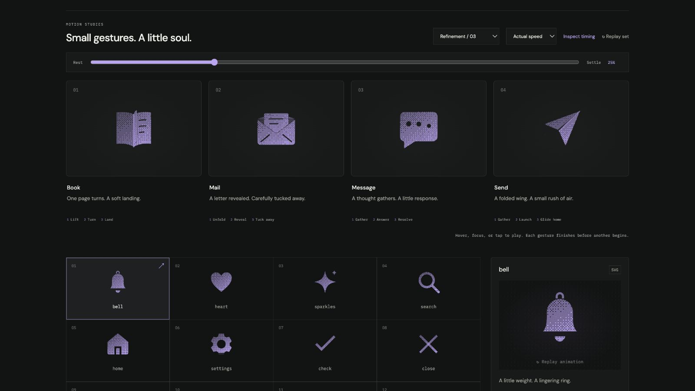

# book: Interface Craft refinement 03

## Context
**Meaning:** open and inspect bound knowledge. **Invariant:** two readable leaves and the full central binding remain visible. Reading invites one considered page turn, not an endless flip loop.

## First Impressions
The previous spread skewed its two broad faces by a few degrees. It retained its book shape but delivered little sense of turning a page or arriving anywhere. Its text highlight had no distinct physical cause.

## Visual Design
Give the open spread gently curved page edges and permanent content lines. A separate leaf turns over the same vertical binding. Its material occluder follows the identical transform and opacity, so the moving leaf hides underlying grain rather than doubling it. The left bed uses 72% ink; the turning leaf uses 98% during its visible movement.

The page's free edge catches light during the turn. At landing, a curved lower-edge glint belongs to the arriving page, while a short breath of air escapes beyond the left edge. The page merges into the receiving stack before its invisible overlay resets; the two identity leaves remain present throughout.

## Interface Design
Gather the right leaf, pass it across the spine, land it on its mirrored left bed. After contact, both shapes yield with matching deformation and easing. Their entire binding stays fixed, including top and bottom endpoints. The landing response happens after the page arrives, and the exterior air decays last.

## Consistency & Conventions
MOT-01–16 apply. The fixed spread supplies identity; the transient overlay is the additional moving page, not a disappearing identity part. It ends hidden at its original transform. Native playback, inspector, and CSS export share all tracks. This does not imply that the containing application changed pages.

## User Context
The static spread remains readable at 24px solid. The finer curl and landing light belong to larger dither previews. Keyboard departure lets the gesture finish, repeated activation does not stack performances, and reduced motion leaves the open book still.

## Top Opportunities addressed
1. Replace a slight two-panel skew with one actual page turn.
2. Keep the complete spine attached through the crossing and landing.
3. Join the page to its receiving bed before the glint and escaping air.

## Encoded storyboard
Source: [book.ts](../../src/motions/book.ts). `TIMING`, `BOOK_ART`, `BOOK_BINDING`, `PAGE`, `BED`, `EDGE`, `LANDING`, `AIR`, and `EASE` expose the performance.

| Time | Action |
| --- | --- |
| 0–140ms | Overlay joins the right stack; the leaf gathers tension. |
| 140–340ms | Outer edge curls toward the binding and catches light. |
| 340–410ms | Leaf crosses the fixed spine at x=12. |
| 610ms | Page meets the mirrored left bed. |
| 670ms | Coupled yielding and landing glint. |
| 715ms | Exterior air reaches its crest. |
| 850–1060ms | Receiving bed rests; overlay merges into the stack. |
| 1160–1360ms | Hidden overlay resets, exact neutral spread. |

## Rendered review
Normal and half-speed playback show a single turn, a landing, then dissipation. The 25% image captures the thin crossing leaf; 45% records contact; 52% shows the later response. At 45% and 49%, the browser-measured page and bed rectangles matched within 0.000031 CSS px. The geometric test also checks both spine endpoints and corresponding curve points between landing frames.

[Landing](../motion-evidence/refinement-03/landing.png) · [Climax](../motion-evidence/refinement-03/climax.png) · [Outline](../motion-evidence/refinement-03/outline.png) · [24px solid](../motion-evidence/refinement-03/compact-book.png) · [Batch validation](../VALIDATION.md#focused-refinement-03--2026-09-09)
