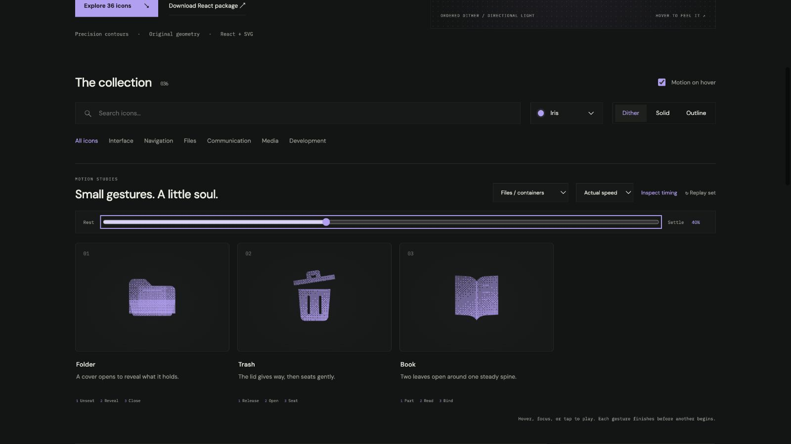

# book: Interface Craft review

## Context
An SVG action icon in a reusable developer library. Its semantic meaning is **open and inspect bound knowledge**. It appears in routine controls where recognition matters more than spectacle.

## First Impressions
A blinking spine ignores the actual relationship between two pages.

## Visual Design
**Identity boundary** — Keep two leaves and their shared spine. Stable dither follows the contour. Color inherits the selected palette; accents use the same ink and stay below the primary silhouette in visual weight. Typography and card framing belong to the shared inspector, not the glyph.

## Interface Design
The missed opportunity is to express **open and inspect bound knowledge** through a causal gesture. Leaves open around a fixed spine, one page catches light, then both nest back against the binding. The inspector exposes replay and timing only when requested; the icon itself adds no controls or labels.

## Consistency & Conventions
Retain the conventional glyph. Use the shared hover, focus, click, reduced-motion, and completion contracts. MOT-01, MOT-02, MOT-03, MOT-04, MOT-05, MOT-08, MOT-09, MOT-10, MOT-11, MOT-12, MOT-14, MOT-15 apply.

## User Context
Reading should feel unhurried; no rapid page-flicking loop. Recognizability must survive a brief glance and the still-motion variant.

## Top Opportunities
1. Leaves open around a fixed spine, one page catches light, then both nest back against the binding.
2. Keep two leaves and their shared spine.
3. Reading should feel unhurried; no rapid page-flicking loop.

## Encoded storyboard and review

**Duration:** 1180ms. **Sequence:** Part / Read / Bind.

Timing source: [files.ts](../../src/motions/files.ts). Geometry binds each named track in `CraftedArtwork.tsx` or `ExtendedArtwork.tsx`. Times below are milliseconds from the same clock; transform values, pivots and easing live in that source.

| Named part | Keyframe times (ms) |
| --- | --- |
| `left-leaf` | 0, 130, 430, 680, 990, 1180 |
| `right-leaf` | 0, 180, 480, 720, 1040, 1180 |
| `page-light` | 0, 310, 520, 800, 1020, 1180 |

**Rendered review:** Both leaves preserve the central binding and stay ordered through opening and closure. The right-page detail follows the opening rather than leading it.

Reviewed at preparation (20%), action (40%), recovery (70%) and neutral endpoint (100%), with actual playback and per-part endpoint inspection in the live gallery. These samples establish the reviewed poses; they do not replace the full timeline or the shared lifecycle checks in [VALIDATION.md](../VALIDATION.md).

**Visual reference:** icon 3 from the left in this family.

[Preparation image](../motion-evidence/rollout/files-containers-prepare.png) · [Recovery image](../motion-evidence/rollout/files-containers-recover.png)
