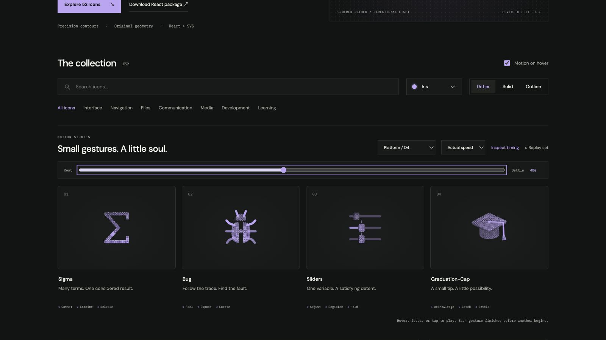

# bug: Interface Craft review

## Context

**Locate a fault without claiming it is fixed.** CraftingAttention's `ParameterRegistrationScanner.tsx:359` uses Bug for the buggy registration case. The real lesson compares a tensor outside the module registry with a correctly registered Parameter. The icon supplies a diagnosis cue; it does not perform that comparison or change the selected case.

## First Impressions

Six legs, paired feelers, head, and two rounded shell halves read immediately as a bug. The existing seam is a useful place to reveal a fault. A disappearing insect or a checkmark transformation would falsely communicate repair.

## Visual Design

The shell carries the dither while narrow appendages use quiet continuous strokes. A fixed dot lives in the center seam. The first outline render crowded that seam: its two inner strokes overlapped. Insetting the outline centerlines restores the same visible clearance as the filled contour. At exposure, the pinpoint ring fits entirely in the widened seam. A close-fitting locator stays around that position rather than becoming a screen-wide scanning effect.

**Identity boundary:** Both shell halves, all six legs, head, and feelers remain present. The body remains centered on its fixed fault; the halves move equal and opposite distances. Opening never resembles deleting or fixing the bug.

## Interface Design

The left feeler probes first, then the right. Both attend inward; forelegs brace before the shell parts. The exposed dot lights, followed by a restrained locator. The diagnosis holds long enough to read. Locator light clears before the seam closes and the appendages relax.

## Consistency & Conventions

MOT-01/03/05 preserve the centered insect and attached limbs. MOT-08/14/16 locate the response at the fault and forbid implied repair. MOT-07/09–13/15 keep the material stable, finish playback, return exactly, respect stillness, share timing, and require the individual review. Platform handoff: UI-2/4, COLOR-2/5, A11Y-2/4, MOTION-1/4/6/7.

## User Context

Use beside a specific debugging or buggy-case label. Color cannot be the only indication of failure. Dense diagnostic controls should use still 24px solid/outline; a larger lesson invitation can use the full gesture. Never bind this preview to a real pass/fail result.

## Top Opportunities

1. Let the feelers and forelegs prepare the shell's action.
2. Preserve negative space around the exact fault location in every material.
3. End with the bug intact; diagnosis and repair are different actions.

## Encoded storyboard and review

**Feel / Expose / Locate · 1320ms**. [bug.ts](../../src/motions/bug.ts) contains the timestamp storyboard and individual actor configuration. [PlatformToolsArtwork.tsx](../../src/PlatformToolsArtwork.tsx) binds the fixed fault and mirrored shell parts.

| Actor | Key times (ms) |
| --- | --- |
| Feelers | 140 left probe; 230 right probe; 330 attend |
| Forelegs | 330 brace; 820 hold; 1170 rest |
| Shell halves | 470 exposed; 820 hold; 1170 close |
| Fault light | 550 pinpoint; 1050 clear |
| Locator | 640 peak; 1050 clear |

Actual/half-speed playback and eight poses reviewed. The final outline image includes the corrected seam; dither, solid, and outline preserve the 48% pose. Start/end geometry matches exactly. See [batch validation](../VALIDATION.md) for lifecycle and responsive proof.

**Reference position: 2 of four.**

[Rest](../motion-evidence/platform-04/pose-0.png) · [Corrected outline](../motion-evidence/platform-04/outline-48.png) · [Light solid](../motion-evidence/platform-04/light-solid-48.png)
