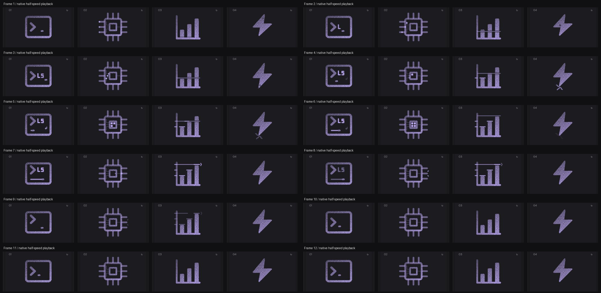

# chart: Interface Craft review

## Context
Compare fixed quantities against one common baseline. Suitable for analytics, progress history, and summaries where the host supplies actual values.

## First Impressions
The rejected dot hopping between bars looked like a tour of three arbitrary points. A measuring line now begins at the baseline, reads each height, and leaves a matching axis tick. The motion explains comparison.

## Visual Design
All three bars retain their heights and order. A narrow measuring slit makes the ruler visible across solid or dithered bars. Foreground ruler and knockout share their position, opacity and horizontal reveal. The final chevron sits beyond the measured width; it is subordinate to the chart.

## Interface Design
The line unfolds along the baseline, rises to each height and briefly dwells. Each height mark follows arrival and stays for the final comparison. The last measurement receives a right-edge register before the line retracts sideways. Hidden recovery cannot sweep back through the data.

## Consistency & Conventions
MOT-01/03/04/05/07/08/15/16 govern identity, connected parts, timing and localized consequences. MOT-09/10/11/12 retain the shared replay, exact return, stillness and export contracts. MOT-14 reserves application state for the host.

## User Context
Native controls retain actual data and state. The icon never animates fabricated growth. Small-size recognition comes from the three bars and axes; detailed measurement accents are optional.

## Top Opportunities
Measure from the shared origin; retain earlier readings; make the final comparison legible without changing quantities.

## Encoded storyboard and review
[Authored timeline](../../src/motions/chart.ts). 1690ms: unfold at 160ms; heights reached at 390/650/910ms; each mark follows by 90ms; final registration at 1020ms; hold to 1240ms; ruler retracts by 1450ms; neutral at 1690ms. Ruler and its mask use identical tracks.

Reviewed the complete live sequence at actual and half speed, eight inspected poses, and identical 58% part matrices across dither/solid/outline. Input and output are visibly connected; temporary marks clear before the final rest. Keyboard playback finishes after departure; reduced motion leaves no active tracks or visible accents. User accepted this concept-level revision on 2026-09-10 and requested the next batch.

[Evidence and limits](../motion-evidence/refinement-08/README.md).

