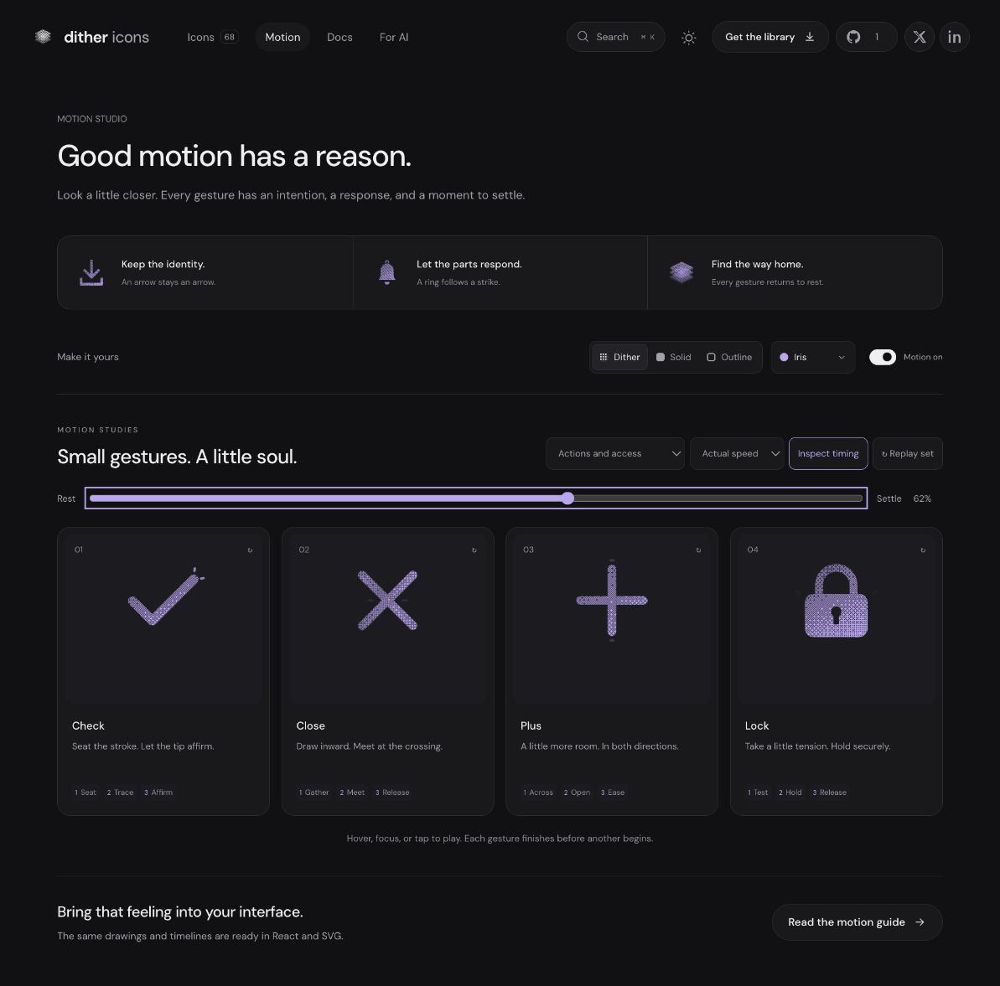

# Check: Interface Craft refinement 06

## Context
**Affirm a completed or valid state.** The platform uses Check in `components/ui/StatefulButton.tsx:68`. This library gesture is a preview; only the host's result may select the success state.

## First Impressions
The earlier check combined translation, scale and rotation; its vertex drifted while the light ran approximately across the drawing. It felt like a small bounce rather than a deliberate finishing stroke.

## Visual Design
One connected ribbon has rounded terminal caps and a rounded outer vertex. The ascending arm is longer, preserving the familiar asymmetric silhouette. Outline uses the same centerline at 1.8 units. A .7-unit highlight lies on the ascending centerline; two .6-unit rays sit beyond its tip. Accents inherit the selected ink. No badge, enclosing ring or replacement check is added.

## Interface Design
The drawn low vertex (9.2, 17.2) stays fixed. A four-degree preparation returns to neutral before light traverses the long arm. The leading endpoint reaches the actual tip (19.8, 6.6) at 590ms; the finishing rays peak 60ms later. The glyph already rests while the response dissipates. That order gives affirmation a readable completion point.

## Consistency & Conventions
MOT-01/03/05/06/07/08/10/11/12/13/14/15/16. Keep the entire check visible, put light on its carrier, finish after input departure and retain the host's state authority. No platform control was changed.

## User Context
Confirmation should feel assured and quick. In solid and outline, the same-color surface trace naturally merges with the main stroke; the exterior tip response remains visible. At 24px, recognition depends on the check itself.

## Top Opportunities
1. Anchor the actual vertex instead of translating the whole glyph.
2. Carry light along the real stroke, with arrival before the payoff.
3. Preserve a quiet, exact ending without elastic wobble.

## Encoded storyboard and rendered review
[check.ts](../../src/motions/check.ts), **1060ms**, **Seat / Trace / Affirm**.

```text
0       110          310  350            590 650       820       1060
rest -- lean -------- seat--trace ------- tip--rays --- clear ---- rest
vertex: fixed ------------------------------------------------ fixed
```

Reviewed preparation at 10%, traveling light at 40%, tip response at 62%, and neutral ending at 100%, plus actual/half-speed and keyboard-departure playback. The geometry test checks both trace endpoints against the drawn long arm and verifies exact tip arrival. All textures retain the inspected pose. Reduced motion stays still.



[Rest](../motion-evidence/refinement-06/pose-0.png) · [Small sizes](../motion-evidence/refinement-06/size-and-export.png) · [Batch validation](../VALIDATION.md#focused-refinement-06--2026-09-10)
