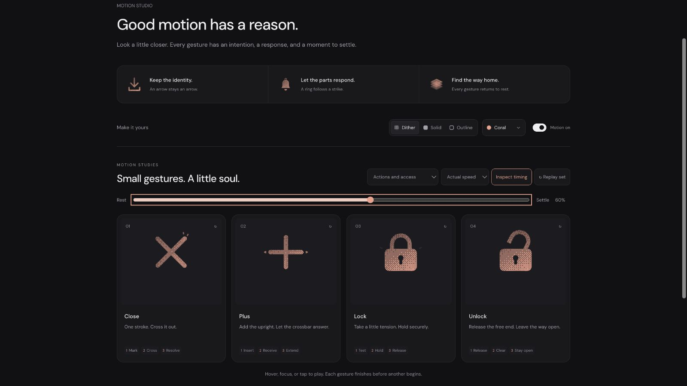

# Close: semantic correction after refinement 06

## Context
**Dismiss the current surface.** Focus Coach uses X in `features/focus-coach/FocusCoachRail.tsx:694`. Keep the familiar X visible throughout; the host performs dismissal.

## First Impressions
The user rejected the previous contraction. Although the fixed angles preserved identity, shrinking both braces read as a generic pulse rather than closing or cancelling. The earlier refinement-06 screenshots are historical, not evidence for this replacement.

## Visual Design
Retain the rounded 2.2-unit bands, fixed ±45° directions and clean single-ink crossing. Translate each complete stroke along its own axis. Moving upper artwork and its knockout share every frame. A small edge light travels with each stroke; two fine finishing marks appear beyond the second stroke's leading tip.

## Interface Design
The first diagonal gathers at 90ms and marks at 230ms. The opposing stroke starts later, crosses at 370ms, then receives its tip finish at 430ms. The slight axial travel suggests two crossing-out strokes without making an incomplete X. The finish clears at 630ms; all geometry is home by 560ms and the clock ends at 820ms.

## Consistency & Conventions
MOT-01/03/05/07/08/09/10/11/12/13/14/15/16. Fixed angles preserve identity; the crossing remains clean during translation. This is a finite cross-out gesture, not a rotation into Plus or a simulated successful dismissal.

## User Context
A short, decisive acknowledgment for a frequent action. The complete silhouette survives every intermediate pose, reduced motion and static SVG export. No shrinking, central ornament or persistent effect.

## Top Opportunities
1. Replace generic contraction with ordered diagonal travel.
2. Put the finish at the final stroke's leading end.
3. Preserve a quiet, exact neutral and clean crossing at compact sizes.

## Encoded storyboard and rendered review
[close.ts](../../src/motions/close.ts), **820ms**, **Mark / Cross / Resolve**.

```text
0      90      170   230     330 370 430      560 630       820
rest -- gather -- second -- mark -- cross--finish -- home--clear--rest
angles: fixed; full strokes remain visible throughout
```

[Current evidence](../motion-evidence/refinement-06-rework/): eight inspected poses, both speeds, keyboard departure, three materials at the same 50% frame, reduced motion and compact SVG exports. Tests verify the moving knockout clock and finish-after-cross ordering. This replaces the rejected contraction; user acceptance of the replacement remains open.


