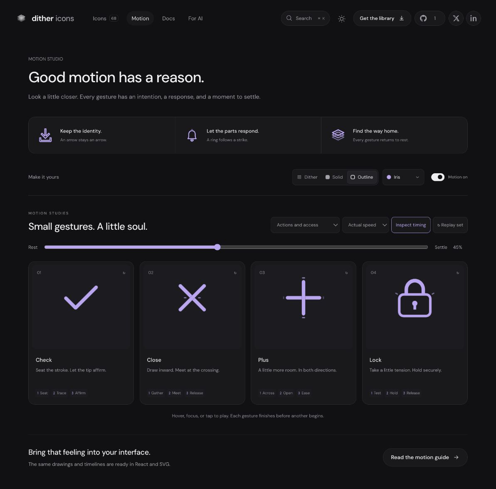

# Close: Interface Craft refinement 06

## Context
**Dismiss the current surface.** The platform's Focus Coach uses X in `features/focus-coach/FocusCoachRail.tsx:694`. A frequent utility action calls for a brief, conclusive gesture.

## First Impressions
The previous diagonals rotated and scaled independently, changing their crossing angle. Sharp polygon ends and overlapping dither made the center heavier. There was no localized finish after the second arm arrived.

## Visual Design
Two rounded 2.2-unit bands cross at fixed 45-degree angles. A browser pass increased their length to match the optical weight of the neighboring glyphs. Outline uses 1.8-unit centerlines. The upper brace masks the lower one with identical geometry and timing, keeping one layer of ink at the crossing. The only accent is a pair of fine lateral marks in the open spaces beside the intersection.

## Interface Design
Each brace gathers then shortens along its own axis about (12, 12). The first registers at 240ms, the second at 300ms. The lateral response waits for both and peaks at 365ms. The compressed cross holds briefly, then releases into its original proportions. The angles never change, so it cannot turn into Plus.

## Consistency & Conventions
MOT-01/03/05/06/07/08/09/10/11/12/13/14/15/16. The shared center is an anchor, not an added mechanical part. Paired tracks keep the moving knockout attached in React and CSS exports. Dismissal itself belongs to the host.

## User Context
Close should feel decisive without demanding attention. Its 840ms gesture is the shortest of this set; the contraction and response happen in the first half. All useful shape remains visible when motion is disabled.

## Top Opportunities
1. Preserve fixed diagonal angles and shorten along the braces.
2. Remove doubled ink at their crossing.
3. Place the response after the second registration, then clear it quickly.

## Encoded storyboard and rendered review
[close.ts](../../src/motions/close.ts), **840ms**, **Gather / Meet / Release**.

```text
0       90 130       240 300   365 420       550     680     840
rest -- gather ----- first--meet--answer--release -- clear--home--rest
center: fixed ------------------------------------------------ fixed
```

Reviewed 10% preparation, 28% first registration, 40/45% crossing response, 75% recovery and 100% rest. Browser material changes retained exact per-part transforms. Targeted tests verify that visible and knockout clocks match and both braces retain their center and angle. Actual/half-speed, keyboard departure and reduced motion passed.



[Rest](../motion-evidence/refinement-06/pose-0.png) · [Small sizes](../motion-evidence/refinement-06/size-and-export.png) · [Batch validation](../VALIDATION.md#focused-refinement-06--2026-09-10)
