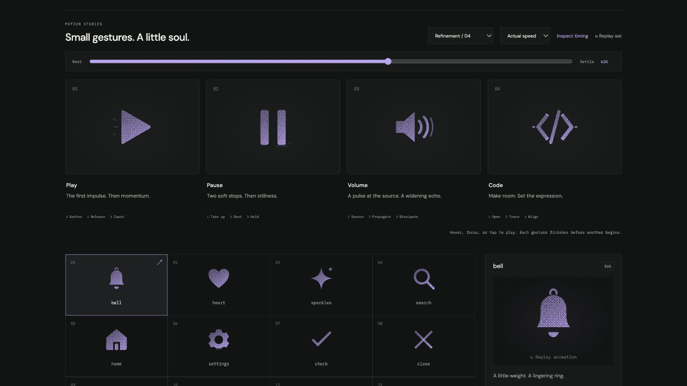

# code: Interface Craft review

## Context

A reusable SVG action icon. Its semantic meaning is **a bounded expression between paired delimiters**. This is one of the four icons in Refinement / 04; the report supersedes its initial broad-rollout review.

## First Impressions

The former brackets moved in opposite directions, but the gesture lacked a precise shared registration event. A small local slash glint did not establish a readable middle beat.

## Visual Design

Mirrored chevrons frame one rounded diagonal slash. The pair opens equally around the expression, with identical timing and easing. A short highlight scans along the existing slash inside a unique clip path. Terminal-edge lights remain attached to their delimiters; the two small outer ticks punctuate their return.

**Identity boundary:** The chevrons remain mirrored around one visible slash at every interpolated pose. No typing loop, new characters, missing delimiter, or checkmark.

## Interface Design

Both delimiters gather, open together, and briefly make room. A short light travels along the slash while it accommodates with a slight tilt. Both brackets then return to the same registration event. Their end faces catch, followed by a paired exterior tick. The slash and brackets are settled before the last light disappears.

## Consistency & Conventions

The shared gallery typography, palette, framing, inspector, and playback controls remain intact. Color is inherited. Dither, solid, and outline share named tracks. MOT-01–08 govern identity, geometry, material, and the causal response; MOT-09–13 govern completion, exact rest, accessibility, shared timing, and rendered verification; MOT-14–16 require truthful preview semantics, this individual review, and a legible climax.

## User Context

This represents code and its structure. It does not claim generated text, successful compilation, or executed code. Compact recognition takes priority over the scan; in solid material the scan can merge into the slash while paired closure remains readable.

## Top Opportunities

1. Treat the brackets as one symmetric relationship.
2. Use the existing slash for the middle beat, with a clipped and attached trace.
3. Give the shared closure a precise local response rather than unrelated bracket wobbles.

## Encoded storyboard

**Duration:** 1160ms. **Sequence:** Open / Trace / Align.

```text
0ms    A complete, paired code glyph
115ms  Equal inward preparation
325ms  Delimiters open symmetrically
370ms  Slash accommodates with a small tilt
440ms  Short highlight crosses the slash
465ms  A brief readable opening
580ms  Slash trace clears
645ms  Both delimiters return into registration
680ms  Attached terminal edges catch
715ms  Two exterior ticks punctuate the alignment
790ms  All identity parts are still
945ms  All transient light has cleared
1160ms Exact neutral expression
```

One named `TIMING` object and per-actor configuration live in [code.ts](../../src/motions/code.ts). Named SVG groups and local effect attachment live in [ControlArtwork.tsx](../../src/ControlArtwork.tsx). Native playback, inspection, and standalone CSS use the same tracks.

| Named part | Keyframe times (ms) |
| --- | --- |
| `bracket-left` | 0, 115, 325, 465, 645, 790, 1160 |
| `registration-left` | 0, 610, 680, 945, 1160 |
| `alignment-left` | 0, 645, 715, 945, 1160 |
| `bracket-right` | 0, 115, 325, 465, 645, 790, 1160 |
| `registration-right` | 0, 610, 680, 945, 1160 |
| `alignment-right` | 0, 645, 715, 945, 1160 |
| `slash` | 0, 115, 370, 465, 645, 790, 1160 |
| `syntax-trace` | 0, 245, 440, 580, 1160 |

## Rendered review

At 30–40% both brackets open equally while the clipped trace stays on the slash. At 62% the exterior ticks give the closure its finishing beat. In light solid the slash glint merges with the material, but the pair and exterior response remain clear. Dark outline stays recognizable, and the 24px solid glyph retains its delimiter/slash relationship.

Reviewed in the live browser at actual and half speed, plus 0%, 10%, 30%, 40%, 50%, 62%, 82%, and 100%. All four icons have identical computed poses at the two neutral endpoints. Paused dither-to-outline switching at 40% preserves every named transform. Keyboard departure finishes the gesture. Reduced motion clears transforms and hides accents; motion-off disables study playback. See [VALIDATION.md](../VALIDATION.md) for the complete batch evidence and limits.

**Visual reference:** icon 4 from the left, in the new four-icon study group.



[Rest](../motion-evidence/refinement-04/pose-0.png) · [Preparation](../motion-evidence/refinement-04/pose-10.png) · [Recovery](../motion-evidence/refinement-04/pose-82.png) · [Outline](../motion-evidence/refinement-04/outline-40.png) · [Light solid](../motion-evidence/refinement-04/light-solid-62.png)
