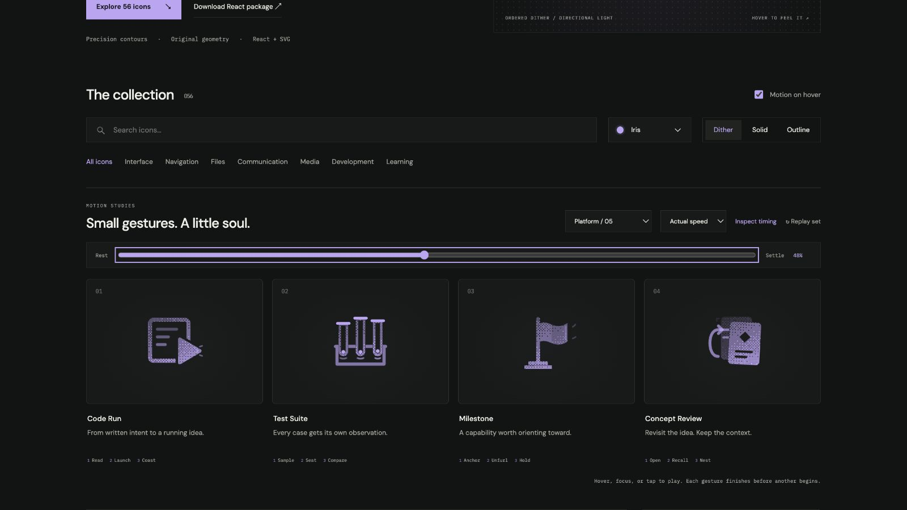

# Concept Review: Interface Craft review

## Context

**Revisit an earlier idea while retaining context.** `content/reviews/nn-review/index.ts:4–13` defines a Review View for Neural Nets From Scratch. This is a proposed affordance for concept review, distinct from Retry or a Workspace Checkpoint.

## First Impressions

Two retained cards plus a return arrow communicate recall. The front card exposes an earlier reading line, giving the arrow an actual destination.

## Visual Design

The front card and its knockout share one track about 19,19.5. A quiet mnemonic diamond and text remain attached. The return arrow uses a 1.1-unit stroke, tangent-connected cubic curves, a horizontal neck and a restrained 45-degree head.

**Identity boundary:** Both cards persist. The arrow remains connected and points to the revealed earlier line; no answer is disclosed or mastery implied.

## Interface Design

Open the front card before the trace starts. Light follows the return contour to the earlier line; that line and its nearby reading witness answer, then the cards nest exactly.

## Consistency & Conventions

MOT-01/02/03/05 preserve meaning, identity, and physical relationships. MOT-07/08/16 bind grain and light to the cause. MOT-09–15 require completed playback, exact rest, reduced-motion support, shared export timing, individual review, and no invented app result. Platform handoff: UI-2/4, COLOR-2/5, A11Y-2/4, MOTION-1/4/6/7.

## User Context

Use a native labeled control for keyboard and touch. Prefer still solid/outline at 24px for repeated actions, and dither at 48px or larger. Motion remains optional; disabled/reduced-motion controls retain their meaning. The library gesture does not change platform state.

## Top Opportunities

User requested additional arrow drawing polish. Reduced the oversized head, slimmed the stroke, and added the missing horizontal neck. Recomputed the light route using 48 samples and a real stroked mask; its interpolation error stays below .01 units.

## Encoded storyboard and review

**Open / Recall / Nest · 1480ms.** [concept-review.ts](../../src/motions/concept-review.ts) contains the timestamp storyboard, named actors and clock. [LearningWorkflowArtwork.tsx](../../src/LearningWorkflowArtwork.tsx) owns their original contours and instance-scoped masks.

1480ms total; prepare 150; open 420; trace 430–700; reading response 780; clear 950; home 1250. Card origin 19,19.5; trace travels from 6.6,17.6 to 8.1,7.5.

Actual and half-speed playback reviewed. Eight reference poses return exactly; dither/outline/solid retain the same 52% transforms, origins and opacity. Keyboard departure, reduced motion, motion-off, 390px layout, 24px solid and 64px dither were inspected. Semantic name and use-case search verified. See [batch validation](../VALIDATION.md).

**Reference position: 4 of four.**

[Rest](../motion-evidence/platform-05/pose-0.png) · [Outline](../motion-evidence/platform-05/outline-52.png) · [Light solid](../motion-evidence/platform-05/light-solid-52.png) · [Compact silhouettes](../motion-evidence/platform-05/collection-24-solid.png)
