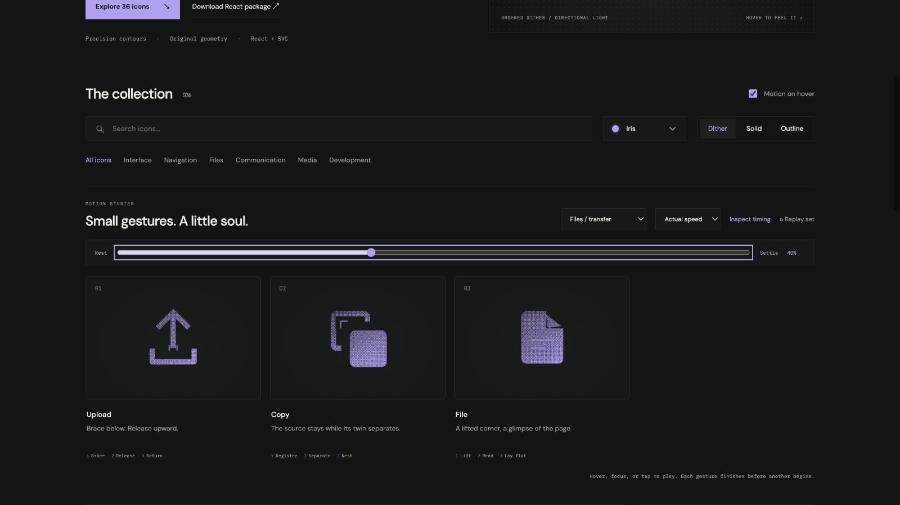

# copy: Interface Craft review

## Context
An SVG action icon in a reusable developer library. Its semantic meaning is **duplicate while retaining the source**. It appears in routine controls where recognition matters more than spectacle.

## First Impressions
Moving only one undifferentiated rectangle hides the source/result relationship.

## Visual Design
**Identity boundary** — Two sheets remain visible throughout. Stable dither follows the contour. Color inherits the selected palette; accents use the same ink and stay below the primary silhouette in visual weight. Typography and card framing belong to the shared inspector, not the glyph.

## Interface Design
The missed opportunity is to express **duplicate while retaining the source** through a causal gesture. The front page separates diagonally from the rear page; a registration cue appears between them and fades. The inspector exposes replay and timing only when requested; the icon itself adds no controls or labels.

## Consistency & Conventions
Retain the conventional glyph. Use the shared hover, focus, click, reduced-motion, and completion contracts. MOT-01, MOT-02, MOT-03, MOT-04, MOT-05, MOT-08, MOT-09, MOT-10, MOT-11, MOT-12, MOT-14, MOT-15 apply.

## User Context
No checkmark replacement; the copy glyph stays a copy glyph. Recognizability must survive a brief glance and the still-motion variant.

## Top Opportunities
1. The front page separates diagonally from the rear page; a registration cue appears between them and fades.
2. Two sheets remain visible throughout.
3. No checkmark replacement; the copy glyph stays a copy glyph.

## Encoded storyboard and review

**Duration:** 1040ms. **Sequence:** Register / Separate / Nest.

Timing source: [files.ts](../../src/motions/files.ts). Geometry binds each named track in `CraftedArtwork.tsx` or `ExtendedArtwork.tsx`. Times below are milliseconds from the same clock; transform values, pivots and easing live in that source.

| Named part | Keyframe times (ms) |
| --- | --- |
| `source` | 0, 150, 350, 760, 1040 |
| `duplicate` | 0, 140, 380, 610, 880, 1040 |
| `registration` | 0, 200, 390, 670, 1040 |

**Rendered review:** The source sheet remains exposed while the front copy separates. Both survive the peak and nesting beats; the registration accent stays subordinate.

Reviewed at preparation (20%), action (40%), recovery (70%) and neutral endpoint (100%), with actual playback and per-part endpoint inspection in the live gallery. These samples establish the reviewed poses; they do not replace the full timeline or the shared lifecycle checks in [VALIDATION.md](../VALIDATION.md).

**Visual reference:** icon 2 from the left in this family.

[Preparation image](../motion-evidence/rollout/files-transfer-prepare.png) · [Recovery image](../motion-evidence/rollout/files-transfer-recover.png)
