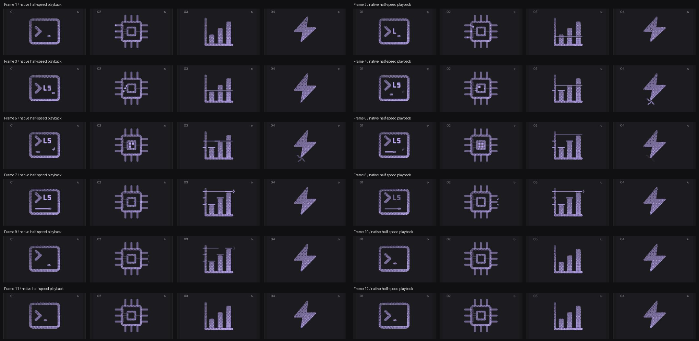

# cpu: Interface Craft review

## Context
A processor receives inputs, changes a register, and emits a result. Use for compute/device affordances, not as an execution-success status.

## First Impressions
The rejected single traveler barely distinguished a CPU from any connected dot. The new die clocks four visible cells before it can transmit. This creates an intermediate processing state with a dependency on completed input.

## Visual Design
Twelve lower-contrast pins and the rounded package stay fixed. Three faint orthogonal traces feed a four-cell die. Cells fit inside the core aperture with a half-unit gap. Signal dots follow actual trace corners; the output echo stays inside the viewBox.

## Interface Design
Three staggered lanes load the core. All inputs arrive before the first register activation. Cells clock in reading order, hold together, gather toward the output gate, then release one pulse through the middle right pin. Exterior ticks follow its arrival.

## Consistency & Conventions
MOT-01/03/04/05/07/08/15/16 govern identity, connected parts, timing and localized consequences. MOT-09/10/11/12 retain the shared replay, exact return, stillness and export contracts. MOT-14 reserves application state for the host.

## User Context
The fixed chip remains recognizable when effects disappear. At compact scale the center activation and left-to-right handoff carry the meaning; full register detail is intended for larger previews. No simulated hardware metric or success claim.

## Top Opportunities
Expose the register operation; connect traces and travelers geometrically; emit only after the complete register is available.

## Encoded storyboard and review
[Authored timeline](../../src/motions/cpu.ts). 1640ms: input begins at 120ms with 55ms stagger; final receipt at 500ms; cells clock at 560/635/710/785ms; loaded hold to 865ms; gather by 950ms; output reaches its pin at 1110ms; echo at 1180ms; clear by 1400ms. All core/package geometry is stationary.

Reviewed the complete live sequence at actual and half speed, eight inspected poses, and identical 58% part matrices across dither/solid/outline. Input and output are visibly connected; temporary marks clear before the final rest. Keyboard playback finishes after departure; reduced motion leaves no active tracks or visible accents. User accepted this concept-level revision on 2026-09-10 and requested the next batch.

[Evidence and limits](../motion-evidence/refinement-08/README.md).

## Outline material correction — 2026-10-02

**Invariant and critique:** Package, twelve pins and empty register remain stationary. Outline the package and register bands; knock out pin cores. Input and output actors keep their own arrival clocks.

**Material rule:** Reuse the reader's 0.5-unit Outline edges and transparent cores. Fine text and small semantic dots stay readable. Applicable: MOT-01, MOT-03, MOT-07, MOT-10, MOT-11, MOT-12, MOT-13 and MOT-15.

**Storyboard retained:** Load / Compute / Emit, 1640ms. Authored tracks remain: `cpu-input-0`, `cpu-input-1`, `cpu-input-2`, `cpu-cell-0`, `cpu-cell-1`, `cpu-cell-2`, `cpu-cell-3`, `cpu-output`, `cpu-answer`. This correction changes material, not the semantic action or timing.

**Rendered review:** [Before/after and compact review](../outline-audit/README.md#correction-evidence) plus [actual 50% browser pose](../outline-audit/browser/pose-50.png). The six inspected poses are 0%, 10%, 35%, 50%, 75% and 100%; actor binding, material-switch pose preservation, keyboard completion and stillness checks are recorded with that evidence. User visual approval remains pending. Standalone SVG retains the authored CSS tracks; CSS hover still ends on departure while React finishes its gesture.
