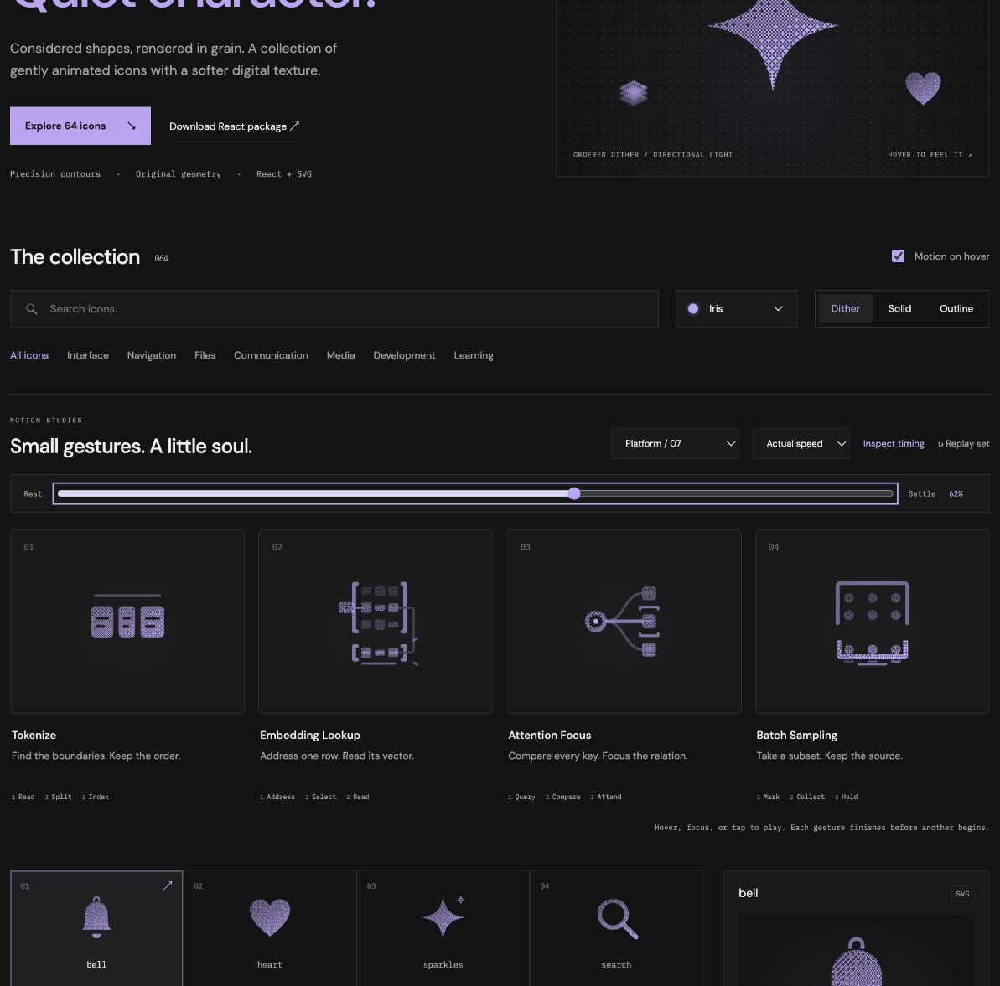

# Embedding Lookup: Interface Craft review

## Context

**Read a vector by its token ID.** `content/tokens-language-modeling/tiny-language-model-lab/index.ts:89–103` explicitly selects a row of an embedding table and returns a copy.

## First Impressions

An address token, a matrix and a retained output row should distinguish lookup from multiplication or destructive extraction.

## Visual Design

A fixed three-row matrix, one small address token, a fine route to a separate vector readout. The selected row and output share their three component shapes.

**Identity boundary:** Every matrix row remains fixed and visible; reading never removes a layer or changes vector values.

## Interface Design

The token meets its address connector. Three row components register in order; a trace follows the real return route into the readout. The readout edge answers after arrival.

## Consistency & Conventions

MOT-01/02/03/05 preserve meaning, identity and causal references. MOT-07/08/16 require attached grain and a localized response. MOT-09–15 govern completed playback, exact rest, input/stillness, shared export timing and individual rendered review. Platform handoff: UI-2/4, COLOR-2/5, A11Y-2/4, MOTION-1/4/6/7.

## User Context

The preview illustrates a copy from a table, not a model prediction. Keep actual token IDs and values in the Lab Unit. Use native labeled controls. Keep small, frequently used icons still in solid/outline; dither benefits from 48px or larger. Keyboard, reduced motion and motion-off retain a complete static drawing.

## Top Opportunities

Make addressing, row selection and readout causally distinct; place the climax at the actual readout.

## Encoded storyboard and review

**Address / Select / Read · 1520ms.** [embedding-lookup.ts](../../src/motions/embedding-lookup.ts) records the timestamp storyboard and named actors; [DataFlowArtwork.tsx](../../src/DataFlowArtwork.tsx) owns the geometry.

| Actor | Timing and attachment |
| --- | --- |
| Address token | Pickup 110ms; its right edge meets x=6.5 connector at 270ms |
| Selected components | Register 340 / 420 / 500ms; table remains fixed |
| Return trace | Leaves at 510ms, reaches output at 800ms; exact line/quadratic carrier with explicit corner samples |
| Readout and edge | Answer at 880ms; clear 1060ms; address home by 1280ms |

The selected row and readout use identical component shapes. The table retains all nine values. Ports in the brackets make the actual return route readable; tests compare motion against the SVG route and bound interpolation error below .012 units. The climax stays at the separate output edge, never implying a removed row.

Actual and half-speed playback reviewed through return. Eight reference poses at 0/10/20/38/52/62/82/100% have identical initial/final computed states. Dither, outline and solid retain the same 62% pose. Keyboard replay and Tab departure, reduced-motion cancellation, disabled motion, light/dark, compact sizes and narrow layout were inspected; details and limits are in [VALIDATION.md](../VALIDATION.md).

**Reference position: 2 of four.**

[Rest](../motion-evidence/platform-07/pose-0.png) · [Outline](../motion-evidence/platform-07/outline-62.png) · [Light solid](../motion-evidence/platform-07/light-solid-62.png)

This completed concept study is retained at the user's request. Future candidates must follow the platform interface selection policy in [PLATFORM-ICONS.md](../PLATFORM-ICONS.md).
