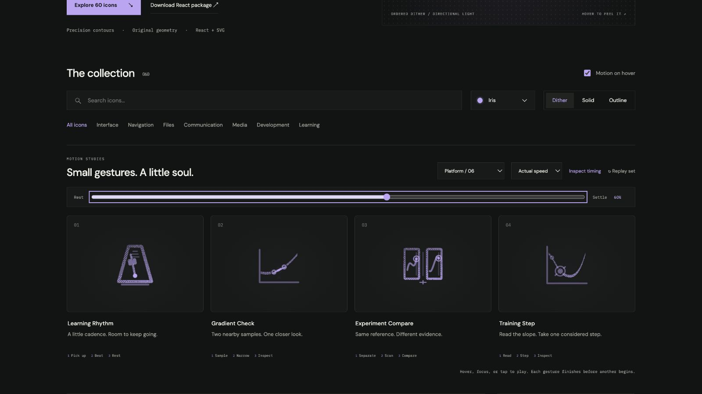

# Experiment Compare: Interface Craft review

## Context

**Inspect two experiments against the same reference.** The Compare control in `MomentumNesterovPhysicsLab.tsx:1167–1171` selects paired optimizer views.

## First Impressions

Two framed plots should be unmistakably different while the viewing motion is synchronized. Neither plot may morph into the other.

## Visual Design

Two original curve windows, one quiet central divider and matching scan cursors. Paired signals use identical normalized x positions, but each point follows its own data contour.

**Identity boundary:** Both datasets and their relative shapes persist. Sampling alignment never forces matching values or a claimed winner.

## Interface Design

Make a little room between panes before scanning. Both cursors travel in the same phase; their plot-specific dots arrive at different values. Local endpoint rings and the common divider answer together.

## Consistency & Conventions

MOT-01/02/03/05 preserve semantics, identity and a causal physical relationship. MOT-07/08/16 require stable grain and a localized response. MOT-09–15 bind full playback, exact rest, input/stillness, shared export timing and individual rendered review. Platform handoff: UI-2/4, COLOR-2/5, A11Y-2/4 and MOTION-1/4/6/7.

## User Context

Comparison is a view affordance. Hover previews it without changing a real optimizer selection. Native labels and actual selection state remain authoritative. Use native labeled controls. Prefer still 24px solid/outline for frequent actions and dither at 48px or larger. Keep keyboard, reduced motion and motion-off useful.

## Top Opportunities

Use synchronized attention rather than identical data; give the two arrivals one readable comparison moment.

## Encoded storyboard and review

**Separate / Scan / Compare · 1520ms.** [experiment-compare.ts](../../src/motions/experiment-compare.ts) records the timestamp storyboard, commented clock and named actors. [LearningPracticeArtwork.tsx](../../src/LearningPracticeArtwork.tsx) owns the original geometry.

| Actor | Key times and attachment |
| --- | --- |
| Left/right panes | Prepare at 150ms; separate by ±.35 units at 360ms; hold through 1060ms; home 1300ms |
| Paired cursors and plot points | Start 380ms; traverse identical normalized x positions; reach their own endpoints 820ms |
| Endpoint rings | Attached to each pane; peak 900ms and clear 1060ms |
| Shared divider receipt | Same 900ms response, below both views |

Both plots keep their original cubic contours. Thirty-six samples follow each different curve while the vertical cursors remain aligned in normalized coordinates. The endpoints remain different values. Browser review confirms the paired endpoint response is later than the two scans; geometry checks also compare carriers against the actual SVG cubic coordinates. The modest pane separation creates breathing room without changing data.

Actual and half-speed sequences inspected through recovery. Eight poses at 0/10/30/44/54/60/84/100% return exactly. Dark Iris dither/outline and light Cobalt solid preserve the same inspected 60% pose. Keyboard departure, disabled motion, reduced motion, 390px layout, 24px solid and 64px dither were reviewed. The standalone SVG rest board was also rendered without JavaScript. See [batch validation](../VALIDATION.md) for evidence and limits.

**Reference position: 3 of four.**

[Rest](../motion-evidence/platform-06/pose-0.png) · [Outline](../motion-evidence/platform-06/outline-60.png) · [Light solid](../motion-evidence/platform-06/light-solid-60.png) · [Static export board](../motion-evidence/platform-06/static.svg)

