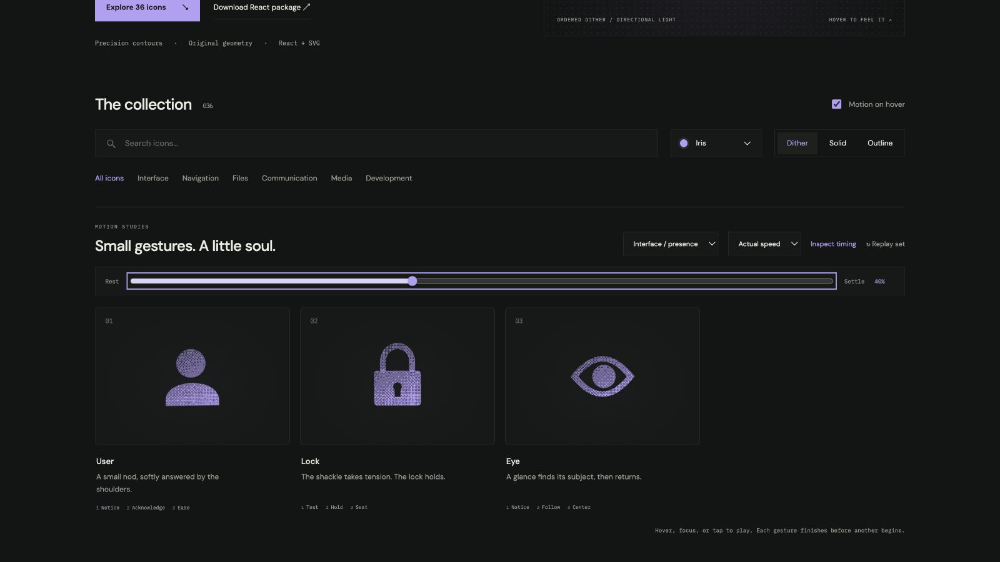

# eye: Interface Craft review

## Context
An SVG action icon in a reusable developer library. Its semantic meaning is **attend to or inspect a visible region**. It appears in routine controls where recognition matters more than spectacle.

## First Impressions
A moving pupil without an aperture constraint can drift outside its eye.

## Visual Design
**Identity boundary** — Eye outline remains stable and pupil stays inside the aperture. Stable dither follows the contour. Color inherits the selected palette; accents use the same ink and stay below the primary silhouette in visual weight. Typography and card framing belong to the shared inspector, not the glyph.

## Interface Design
The missed opportunity is to express **attend to or inspect a visible region** through a causal gesture. Pupil looks left, follows right, and centers; a pupil highlight follows attention. The inspector exposes replay and timing only when requested; the icon itself adds no controls or labels.

## Consistency & Conventions
Retain the conventional glyph. Use the shared hover, focus, click, reduced-motion, and completion contracts. MOT-01, MOT-02, MOT-03, MOT-04, MOT-05, MOT-08, MOT-09, MOT-10, MOT-11, MOT-12, MOT-14, MOT-15 apply.

## User Context
No rapid blink or eye strain-inducing jitter. Recognizability must survive a brief glance and the still-motion variant.

## Top Opportunities
1. Pupil looks left, follows right, and centers; a pupil highlight follows attention.
2. Eye outline remains stable and pupil stays inside the aperture.
3. No rapid blink or eye strain-inducing jitter.

## Encoded storyboard and review

**Duration:** 1400ms. **Sequence:** Notice / Follow / Center.

Timing source: [presence.ts](../../src/motions/presence.ts). Geometry binds each named track in `CraftedArtwork.tsx` or `ExtendedArtwork.tsx`. Times below are milliseconds from the same clock; transform values, pivots and easing live in that source.

| Named part | Keyframe times (ms) |
| --- | --- |
| `pupil` | 0, 230, 440, 720, 920, 1220, 1400 |
| `attention-light` | 0, 490, 730, 1000, 1260, 1400 |

**Rendered review:** The pupil looks left, follows right, and centers inside a fixed aperture. A scoped clip prevents escape; the outline never blinks away.

Reviewed at preparation (20%), action (40%), recovery (70%) and neutral endpoint (100%), with actual playback and per-part endpoint inspection in the live gallery. These samples establish the reviewed poses; they do not replace the full timeline or the shared lifecycle checks in [VALIDATION.md](../VALIDATION.md).

**Visual reference:** icon 3 from the left in this family.

[Preparation image](../motion-evidence/rollout/presence-prepare.png) · [Recovery image](../motion-evidence/rollout/presence-recover.png)
