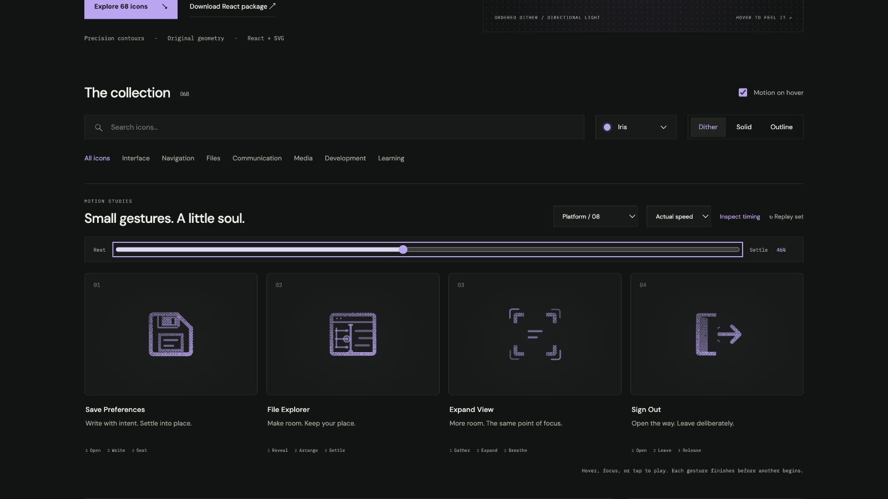

# File Explorer: Interface Craft review

## Context

**Reveal the Lab Unit file explorer without losing the active file.** Actual platform call site: `routes/lab.$slug.tsx:1669–1678` has a functional Show/Hide file explorer button with PanelLeftOpen/PanelLeftClose.

## First Impressions

A browser/editor frame, left file tree and right source lines are more precise than another folder metaphor. The outer frame remains stable.

## Visual Design

**Identity boundary:** The tree stays connected at each branch; code remains within the frame. All source lines and nodes are retained during expansion and recovery.

## Interface Design

The divider opens room; branch ends and source lines share its displacement. A selected file answers after the room exists, followed by a small divider-seat witness.

## Consistency & Conventions

MOT-01/03/05 bind meaning, causal attachment and stable references. MOT-07/08/16 bind attached grain and a localized climax. MOT-09–15 bind completed playback, exact rest, keyboard, stillness, shared export timing and individual rendered review. Platform handoff: UI-2/4, COLOR-2/5, A11Y-2/4 and MOTION-1/4/6/7.

## User Context

Use this for the Show file explorer affordance; the hide state still needs its correct label and icon treatment. The gallery gesture never changes explorerOpen. Frequent compact controls should use still solid/outline, with their native target and accessible label. Use the full dither gesture for larger, infrequent entry points.

## Top Opportunities

1. Preserve the familiar control silhouette through every frame.
2. Stage the response after its physical cause, at the relevant part.
3. Keep the static variant and the real platform state authoritative.

## Encoded storyboard and review

**Reveal / Arrange / Settle · 1460ms.** [file-explorer.ts](../../src/motions/file-explorer.ts) records the timestamp storyboard and named actors; [PlatformActionsArtwork.tsx](../../src/PlatformActionsArtwork.tsx) owns the original drawing.

| Actor | Timing and attachment |
| --- | --- |
| Divider, code and nodes | Shared 2.3px displacement at 500ms; hold to 940ms; home at 1240ms |
| Tree branches | Fixed spine at x=5.6; branch scale derives from that same displacement and easing |
| Active-file witness | Peak 600ms after the layout opens; nested inside the moving nodes |
| Divider seat marks | Peak 680ms; clear 940ms before recovery |

The tree's three endpoints stay connected through interpolation, and the source remains clipped to the fixed editor interior. The selected-file ring travels with its node. The sidebar creates room without a detached tree or stretched source text. The 24px solid render retains the split-pane silhouette; detailed motion benefits from the larger study.

Actual and half-speed sequences reviewed through recovery. Eight native poses at 0/10/24/34/46/52/82/100% have identical initial/final computed states. Dither, outline and solid retain the same 52% pose. Each icon was keyboard-replayed, allowed to finish after Tab departure, cancelled under reduced motion and disabled with motion off. Light/dark, 24px solid, 64px dither and a 390px two-column layout were inspected. See [batch validation](../VALIDATION.md) for evidence and limits.

**Reference position: 2 of four.**

[Rest](../motion-evidence/platform-08/pose-0.png) · [Outline](../motion-evidence/platform-08/outline-52.png) · [Light solid](../motion-evidence/platform-08/light-solid-52.png) · [Compact](../motion-evidence/platform-08/collection-solid-24.png)
