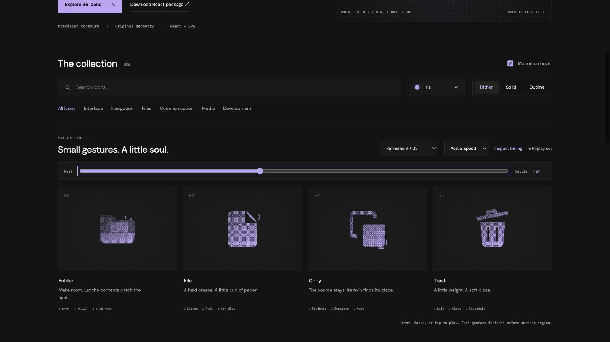

# file: Interface Craft refinement 02

## Context
**Meaning:** a document with a folded corner. The action is a small peel of paper around an existing crease. This review supersedes the earlier rollout assessment.

## First Impressions
The old page drifted slightly and its fold rotated around one point. That made the folded surface feel loosely attached. Its content highlight also disappeared into a solid fill. The distinctive corner deserved to carry the gesture.

## Visual Design
The page is now completely anchored. The triangular fold narrows in projection around the diagonal from (14,2) to (20,8); both crease endpoints stay fixed. A thin permanent crease preserves the corner while the flap approaches edge-on. Two quiet text lines remain visible in all materials, using actual cutouts for solid.

The crease catches a short highlight; a fine curved air mark appears outside the peeling corner. Their stroke widths remain well below the main outline. Neither changes the document's identity.

## Interface Design
The fold takes up tension for 130ms, peels toward the hinge by 400ms, and pauses briefly. The crease light peaks at 445ms, followed by the small curl at 490ms. The paper lays down through a single restrained elastic correction. The entire page does not float or rotate.

## Consistency & Conventions
MOT-01–13 and MOT-14–16 apply. Physical attachment gives the movement meaning; the climax stays localized at the corner. The existing single browser clock is retained. SVG export, frame inspection, and native React playback share the same affine hinge transforms.

## User Context
This is a document affordance, not a writing or file-creation simulation. The two content lines are already present at rest. A quiet corner peel offers tactile interest without adding a progress or success state.

## Top Opportunities addressed
1. Hold both crease endpoints instead of rotating around one corner.
2. Let the paper's edge catch light and shed a small curl of air.
3. Preserve readable page content in solid as well as dither and outline.

## Encoded storyboard
Source: [file.ts](../../src/motions/file.ts). `TIMING`, `FILE_ART`, `FILE_HINGE`, `FOLD`, `GLINT`, `CURL`, and `EASE` carry the decisions. The hinge composes a fixed 45-degree rotation, a perpendicular scale, and the inverse rotation around (17,5).

| Time | Action |
| --- | --- |
| 0–130ms | Fold gathers to 1.04 perpendicular scale. |
| 130–400ms | Fold peels to 0.18 projection; both crease ends remain fixed. |
| 285–445ms | Crease light builds to its crest. |
| 340–490ms | Curled air mark follows the peeling edge. |
| 620–800ms | Fold starts returning; accents disappear. |
| 940–1160ms | A 1.035-scale paper correction resolves to exact rest. |

## Rendered review
Second icon in Refinement / 02. The 42% reference captures the fold, crease light, and curl together. Dither, outline, and light Cobalt solid were inspected; the body remains fixed and the fold stays connected along its diagonal. Automated interpolation checks verify both crease endpoints. [Batch validation](../VALIDATION.md#focused-refinement-02--2026-09-09) covers input, stillness, and responsive review.

[Rest](../motion-evidence/refinement-02/rest.png) · [Preparation](../motion-evidence/refinement-02/prepare.png) · [Recovery](../motion-evidence/refinement-02/recover.png) · [Solid](../motion-evidence/refinement-02/solid-light.png) · [Outline](../motion-evidence/refinement-02/outline.png)
