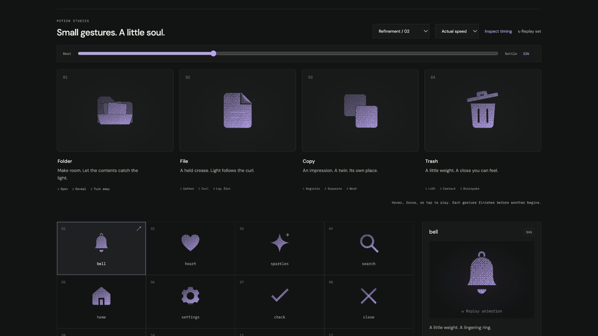

# file: Interface Craft polish

## Context
**Meaning:** a document with content and a folded corner. **Invariant:** the page and both diagonal crease endpoints stay fixed. Movement belongs to the folded paper, never the whole document.

## First Impressions
The previous flap narrowed almost to a line and exposed an empty triangular hole. Its hinge was geometrically sound, but the intermediate picture looked like missing paper. An exterior air curl could not repair that material discontinuity.

## Visual Design
Place a quieter, complete paper underside below the moving flap. It uses 58% opacity and the same attached dither. The flap's moving occluder prevents doubled grain; a 0.16-unit seam distinguishes the surfaces. Round the free inner corner by 0.65 units.

The fold keeps at least 30% of its perpendicular projection. A short curved lip highlight moves with it, a softer diagonal crease light answers, and the exterior air curl follows. The page's content marks remain stationary. A first 32%-opacity underside was too faint in dark dither; live review increased it to 58%.

## Interface Design
A 110ms gather leads into the peel. The lip catches light at 405ms; the crease crests at 435ms; the air follows at 475ms. The fold begins returning at 575ms while the accent dissipates. Its eased return has a small material correction, not a detached swing or whole-page bounce.

## Consistency & Conventions
MOT-01–13 and MOT-14–16 apply. The diagonal hinge at (17,5) keeps (14,2) and (20,8) fixed through every interpolated pose. The visible fold and its occluder share one track. The new lip light inherits the fold's frame. React and CSS receive the same definitions.

## User Context
A document icon must read instantly in a list. Content, outer silhouette, and diagonal crease remain legible in the static and reduced-motion versions. The delicate lip is optional detail, strongest in dither and outline; its loss at 24px does not remove meaning.

## Top Opportunities addressed
1. Preserve a continuous paper surface throughout the peel.
2. Let light originate on the curled edge before the air response.
3. Overlap return and dissipation instead of freezing the open corner.

## Encoded storyboard
Source: [file.ts](../../src/motions/file.ts). `TIMING`, `FILE_ART`, `FILE_HINGE`, `FOLD`, `EDGE`, `GLINT`, `CURL`, and `EASE` expose geometry and pacing.

| Time | Action |
| --- | --- |
| 0–110ms | The flap gathers to 102.5% projection. |
| 110–365ms | It peels to 30%, exposing the quieter underside. |
| 205–435ms | Curved lip then diagonal crease catch light. |
| 345–475ms | Exterior air curl grows after the peeling edge. |
| 575–770ms | The corner starts returning while the light disappears. |
| 895ms | Paper lays down at 101.8% projection. |
| 1160ms | Exact neutral fold. |

## Rendered review
The 32% reference captures the thinnest fold; 44% shows the continuous underside and curl. Light solid makes the layered paper particularly clear. Outline was checked for crease crowding, and solid collection icons at 24px for recognition. Normal/half-speed playback and material switching were reviewed. [Current validation](../VALIDATION.md#refinement-02-polish--2026-09-09).

[Reveal](../motion-evidence/refinement-02-polish/reveal.png) · [Light solid](../motion-evidence/refinement-02-polish/solid-light.png) · [Outline](../motion-evidence/refinement-02-polish/outline.png) · [Rest](../motion-evidence/refinement-02-polish/settled.png)
