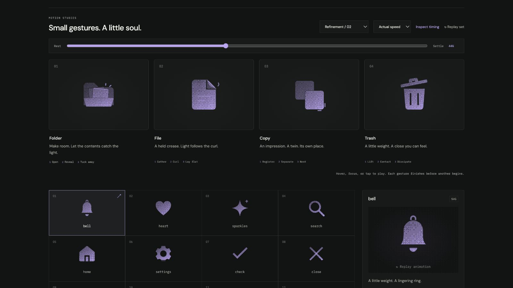

# folder: Interface Craft polish

## Context
**Meaning:** contain and reveal grouped files. **Invariant:** the tab, planted back, and hinged front remain a folder through the reveal. This pass stays within Refinement / 02.

## First Impressions
The previous planes separated correctly, but the papers had square corners and the cover paused partway through its return. The exterior rays had little connection to the material they celebrated. The gesture needed a more connected reveal and closure.

## Visual Design
Round the two paper corners by 0.6 units. Keep the shaded back at 45%, rear paper at 60%, front paper at 90%, and full-strength cover. Matching moving masks preserve a transparent 0.32-unit seam, so stacked dither does not accumulate into a luminous band.

A fine edge light lives **inside the moving front-paper group**. It extends across the exposed sheet before the two exterior rays crest. The object supplies the first response; the surrounding space supplies the echo.

## Interface Design
The bottom hinge opens first. Rear and front sheets follow with opposite −6° / +5° fans. The cover relaxes slightly as the front sheet arrives. On return, the rear sheet starts tucking before the front; the cover follows in one uninterrupted closing arc. Its former intermediate stopping point is removed.

## Consistency & Conventions
MOT-01–13 and MOT-14–16 apply. The gesture previews discovery without claiming that a folder opened in the host application. Every occluder shares its visible plane's exact origin, timing, and easing. Grain stays attached to the paper.

## User Context
The conventional closed folder remains useful at 24px in solid and with motion disabled. At 112px, layered surfaces and the edge-light handoff supply detail. Accents carry no required information. Keyboard departure lets the complete gesture finish.

## Top Opportunities addressed
1. Connect the material's edge response to the exterior reveal rays.
2. Give the fan finer contours and clearer depth.
3. Close in one continuous arc after the contents start clearing.

## Encoded storyboard
Source: [folder.ts](../../src/motions/folder.ts). Named `TIMING`, `FOLDER_ART`, `COVER`, `REAR`, `FRONT`, `EDGE`, `REVEAL`, and `EASE` define the performance.

| Time | Action |
| --- | --- |
| 0–105ms | Cover preloads 1.8%. |
| 105–325ms | Cover opens to 55% vertical projection about y=20. |
| 165–420ms | Rear sheet rises 2.4 units, fans −6°. |
| 235–495ms | Front follows 2.8 units upward, fans +5°. Cover relaxes to 59%. |
| 390–585ms | Attached edge light grows, then reveal rays crest. |
| 615 / 675ms | Rear then front begin tucking. |
| 745–1110ms | Cover closes continuously while the papers clear by 955ms. |
| 1110–1320ms | Small material correction resolves to exact rest. |

## Rendered review
Reviewed at normal and half speed, and at eight paused poses. The 44% frame shows the edge/ray handoff and clean paper separation. At 85%, the contents have cleared and the cover is completing its closure. Solid at 24px remains recognizable; outline retains distinct paper planes. [Current validation](../VALIDATION.md#refinement-02-polish--2026-09-09) records the interaction checks.

[Rest](../motion-evidence/refinement-02-polish/rest.png) · [Preparation](../motion-evidence/refinement-02-polish/prepare.png) · [Recovery](../motion-evidence/refinement-02-polish/recover.png) · [Outline](../motion-evidence/refinement-02-polish/outline.png)
