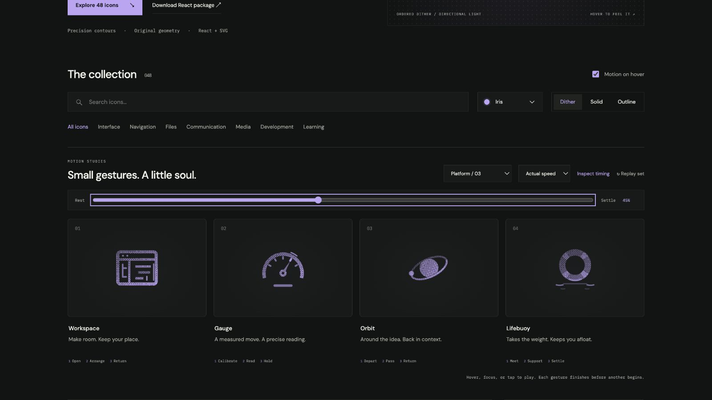

# gauge: Interface Craft review

## Context

**Take a reading against a stable scale.** The command palette uses Gauge for Dashboard navigation, and the learning catalog uses it beside difficulty. The glyph identifies an overview or measurement; its preview does not increase Progress.

## First Impressions

A broad calibrated arc surrounds a narrow needle and fixed pivot. The needle's brief draw-back, measured approach, and small residual deflection feel like a mechanism registering a reading. The scale itself remains trustworthy because it stays still.

## Visual Design

Five radial ticks share the dial's center. The needle points at the 300-degree reference tick at rest. The hub occludes the needle's base, preserving an open aperture without doubled grain. A short exterior arc sits directly beyond the registered tick, not around the whole dial.

**Identity boundary:** The rim, ticks, pivot, and baseline remain fixed. The entire needle stays inside the calibrated arc, including outline stroke. The needle ends at its original reading.

## Interface Design

Draw back 24 degrees, approach with five degrees of overshoot, then seat on the reference. That exact registration lights the corresponding tick. The exterior echo peaks later, while a final 0.9-degree residual movement settles. The motion reads as calibration, not an animated score increase.

## Consistency & Conventions

MOT-01/03/05 preserve the scale and its relation to the needle. MOT-06/08/16 constrain overshoot and place the climax at the actual reading. MOT-09–15 retain the common lifecycle and export contract. Platform integration uses UI-2/4, COLOR-2/5, A11Y-2/4, MOTION-1/4/6/7. A real metric still needs a label and data; the decorative preview supplies neither.

## User Context

Dashboard navigation should feel dependable. Use static solid/outline at small sizes. Reserve the whole performance for a deliberate preview or infrequent overview invitation; do not rerun it for every metric update.

## Top Opportunities

1. Anchor every measurement to one center and one fixed scale.
2. Make the tick answer when the needle registers, not when hover starts.
3. Finish by holding the original reading rather than seeking a higher one.

## Encoded storyboard and review

**Calibrate / Read / Hold · 1280ms**. Source: [gauge.ts](../../src/motions/gauge.ts).

| Actor / origin | Key times (ms) |
| --- | --- |
| `needle` / 12,14.5 | 140 draw-back; 400 overshoot; 475 seat; 650 residual; 880 home |
| `reading-tick` / reference at radius 7.4, angle 300° | 400 start; 475 peak; 850 clear |
| `reading-echo` / 12,14.5 | 475 start; 545 peak; 850 clear |

Tracks start at 0 and finish at 1280ms. Actual/half-speed playback and eight poses show the small deflection against the stationary ticks. The echo is fine but visible at the upper-right reading. Dither, solid, and outline keep the same inspected pose; 0/100% poses match. Reviewed 24px solid and 64px dither, keyboard departure, reduced motion, motion-off, and the 390px layout. See [validation](../VALIDATION.md).

**Reference position: 2 of four.**

[Draw-back](../motion-evidence/platform-03/pose-10.png) · [Registration approach](../motion-evidence/platform-03/pose-36.png) · [Light solid](../motion-evidence/platform-03/light-solid-36.png)
