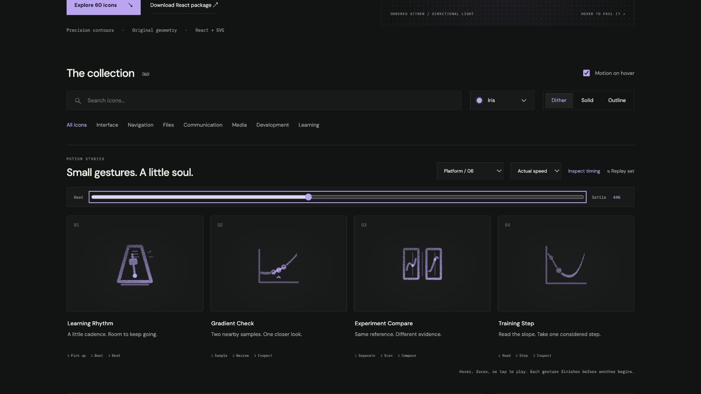

# Gradient Check: Interface Craft review

## Context

**Inspect a derivative using two neighboring samples.** The Centered audit control in `GradientCheckMicroscope.tsx:583–593` currently uses GitBranch.

## First Impressions

Two equal-distance probes on a curve communicate a centered difference; a third branch or generic checkmark would lose that meaning.

## Visual Design

One fixed curved function, a fixed central tangent, two hollow sample beads and a fine joining secant. Preserve the distinction between the curve and its straight chord.

**Identity boundary:** The probes always sample opposite sides of the same center. Each stays on the actual curve. The chord endpoints track both beads through interpolation.

## Interface Design

Both probes take up a little space then approach symmetrically. Their connecting chord follows both endpoints continuously. At the smaller neighborhood, a local central inspection mark answers; hold before restoring.

## Consistency & Conventions

MOT-01/02/03/05 preserve semantics, identity and a causal physical relationship. MOT-07/08/16 require stable grain and a localized response. MOT-09–15 bind full playback, exact rest, input/stillness, shared export timing and individual rendered review. Platform handoff: UI-2/4, COLOR-2/5, A11Y-2/4 and MOTION-1/4/6/7.

## User Context

This is an inspection, not a derivative-pass result. No checkmark or success color. The actual numerical comparison remains the lesson’s responsibility. Use native labeled controls. Prefer still 24px solid/outline for frequent actions and dither at 48px or larger. Keep keyboard, reduced motion and motion-off useful.

## Top Opportunities

Derive bead and chord poses from one distance; retain the visible secant-versus-tangent distinction.

## Encoded storyboard and review

**Sample / Narrow / Inspect · 1500ms.** [gradient-check.ts](../../src/motions/gradient-check.ts) records the timestamp storyboard, commented clock and named actors. [LearningPracticeArtwork.tsx](../../src/LearningPracticeArtwork.tsx) owns the original geometry.

| Actor | Key times and attachment |
| --- | --- |
| Left/right probes and knockouts | Span 6 at rest; 6.25 at 140ms; 2.5 at 560ms; hold through 910ms; original span at 1280ms |
| Secant | Matrix about (12,13.56) shares every probe sample and interpolation clock |
| Center ring and witness | Wait for both probes at 560ms; peak 650ms; clear 910ms |

The function is the drawn quadratic `y = 15 − .5(x−12) − .04(x−12)²`. Both samples retain equal distance from x=12. The chord uses the actual symmetric secant offset; it approaches the fixed tangent without claiming numerical agreement. Tests compare the motion against the SVG's quadratic control points and check coupled endpoints between frames.

The first drawing placed dithered probe circles around SVG origin zero, clipping their texture. They now begin at their actual positive rest coordinates and move by offsets; static exports preserve the same geometry. The central inspection ring was reduced from 1.45 to .95 units after the render showed crowding between the paired beads.

Actual and half-speed sequences inspected through recovery. Eight poses at 0/10/30/44/54/60/84/100% return exactly. Dark Iris dither/outline and light Cobalt solid preserve the same inspected 60% pose. Keyboard departure, disabled motion, reduced motion, 390px layout, 24px solid and 64px dither were reviewed. The standalone SVG rest board was also rendered without JavaScript. See [batch validation](../VALIDATION.md) for evidence and limits.

**Reference position: 2 of four.**

[Rest](../motion-evidence/platform-06/pose-0.png) · [Outline](../motion-evidence/platform-06/outline-60.png) · [Light solid](../motion-evidence/platform-06/light-solid-60.png) · [Static export board](../motion-evidence/platform-06/static.svg)

