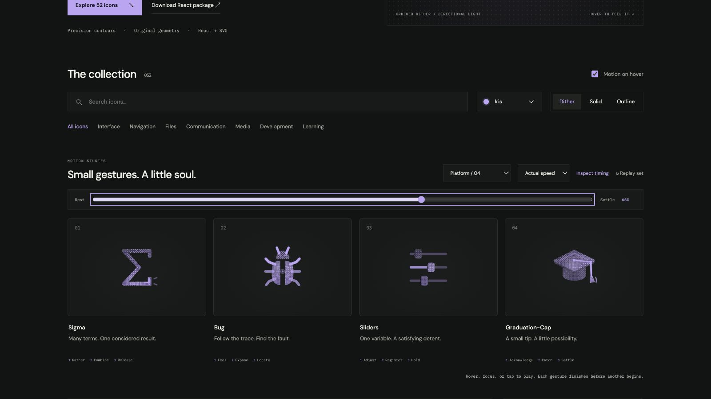

# graduation-cap: Interface Craft review

## Context

**Acknowledge the invitation to learn.** CraftingAttention's `PlatformCommandPalette.tsx:89–94` uses GraduationCap for Browse Paths. This is curriculum discovery, not a certificate or completion event. A modest cap tip suits that invitation; a flying cap or confetti would make the wrong promise.

## First Impressions

The mortarboard, shaded crown, and suspended tassel form a recognizable academic cap. The best motion opportunity is the weight hanging from the rigid board: it can lag and catch after the board has stopped, making the object feel assembled rather than globally wiggled.

## Visual Design

An original diamond plane has a narrow thickness rim over a rounded crown. The board occludes the crown to avoid doubled grain at their overlap. A cord runs from the central button to the suspension point at 20,9.4. The hanging portion pivots there; the tuft has a second hinge at 20,16.3. The outline uses simpler centerlines and a compact tuft so small-size detail does not become noisy.

**Identity boundary:** Board and crown move rigidly together. The hanging cord remains attached at its board hinge, and the tuft remains attached at the cord's end throughout both nested rotations. The cap never leaves the icon or changes into a reward symbol.

## Interface Design

A small counter-tip leads a six-degree acknowledgement. The cord lags before relaxing toward gravity while the board holds. As the board returns, the attachment carries its remaining momentum: cord reverses, tuft follows, and a short local arc answers near the tuft. One diminishing correction finishes the gesture.

## Consistency & Conventions

MOT-03/05/07 preserve both physical hinges, the rigid cap, and attached grain. MOT-06 allows the restrained object-specific tip; it is not permission for a whole-icon bounce or loop. MOT-08/14/16 put the payoff in the weighted attachment without claiming graduation. MOT-01/09–13/15 preserve identity, shared playback, exact return, stillness, and individual review. Platform handoff: UI-2/4, COLOR-2/5, A11Y-2/4, MOTION-1/4/6/7.

## User Context

Use beside Browse Paths, inheriting the native link's label and target. It does not certify a completed Path, Milestone, or degree. A frequently visited command-palette item should use a still compact glyph; the complete motion fits a larger curriculum entry point.

## Top Opportunities

1. Let the crown and board remain one object.
2. Give the hanging cord and tuft distinct, connected responses.
3. Place the climax after the board stops, where the tassel reverses.

## Encoded storyboard and review

**Acknowledge / Catch / Settle · 1440ms**. [graduation-cap.ts](../../src/motions/graduation-cap.ts) contains the timestamp storyboard and named actor configs. [PlatformToolsArtwork.tsx](../../src/PlatformToolsArtwork.tsx) encodes the two nested hinges and crown occlusion.

| Actor / origin | Key times (ms) |
| --- | --- |
| Rigid cap / 12,16 | 140 counter-tip; 400 tip; 590 hold; 810 home |
| Cord / 20,9.4 | 470 lag; 590 gravity alignment; 875 reversal; 1090 rebound; 1440 still |
| Tuft / 20,16.3 | 470 lag; 940 catch; 1090 small rebound; 1260 still |
| Board edge | 810 response; 1090 clear |
| Local tassel arc | 940 peak; 1090 clear |

Actual and half-speed playback reviewed, including the late tassel response. Eight poses return exactly. Materials retain the same 48% pose, with the crown behind the board. See [batch validation](../VALIDATION.md) for lifecycle and compact-size checks.

**Reference position: 4 of four.**

[Tip](../motion-evidence/platform-04/pose-28.png) · [Rest](../motion-evidence/platform-04/pose-0.png) · [Outline](../motion-evidence/platform-04/outline-48.png)
