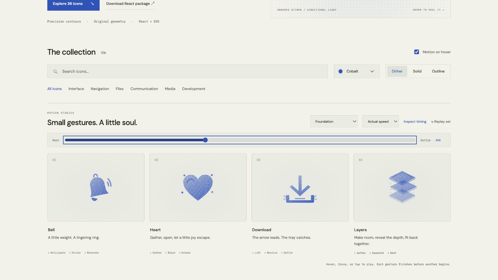

# heart: Interface Craft review

## Context
An SVG action icon in a reusable developer library. Its semantic meaning is **express affection through a brief release of energy**. This is one of the four user-accepted foundation performances.

## First Impressions
A uniform pulse has no emotional phrasing.

## Visual Design
**Identity boundary** — Two lobes and the heart point remain visible. Stable dither follows the material. Accents inherit the same ink and remain subordinate.

## Interface Design
Compress, open with a small overshoot, let four quiet flecks escape, and exhale. Playback, scrubbing and the still variant share the same named parts.

## Consistency & Conventions
MOT-01, MOT-02, MOT-03, MOT-04, MOT-05, MOT-07, MOT-08, MOT-09, MOT-10, MOT-11, MOT-12, MOT-14, MOT-15 apply. Preserve the accepted performance while extending the vocabulary.

## User Context
Preview feedback must not assert that an application action succeeded. Keyboard, touch, and reduced-motion users retain the same recognizable icon.

## Top Opportunities
1. Preserve the accepted causal sequence.
2. Two lobes and the heart point remain visible.
3. Keep the neutral return and interrupted-input behavior consistent.

## Encoded storyboard and review

**Duration:** 820ms. **Sequence:** Gather / Bloom / Exhale.

Timing source: [choreography.ts](../../src/choreography.ts). Geometry binds each named track in `CraftedArtwork.tsx` or `ExtendedArtwork.tsx`. Times below are milliseconds from the same clock; transform values, pivots and easing live in that source.

| Named part | Keyframe times (ms) |
| --- | --- |
| `heart` | 0, 130, 310, 470, 640, 820 |
| `heart-light` | 0, 130, 280, 560, 820 |
| `fleck-0` | 0, 180, 290, 560, 820 |
| `fleck-1` | 0, 198, 308, 578, 820 |
| `fleck-2` | 0, 216, 326, 596, 820 |
| `fleck-3` | 0, 234, 344, 614, 820 |

**Review:** The heart remains the dominant silhouette; escaping flecks never replace it. See the [foundation playback and identity review](../MOTION-REVIEW.md). This rollout preserves its accepted tracks.

