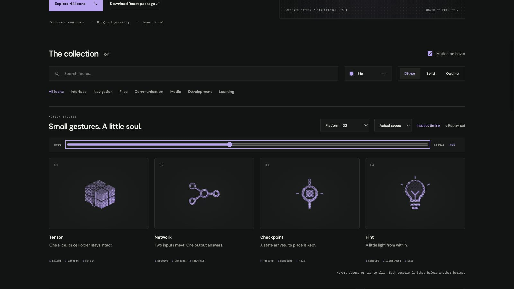

# hint: Interface Craft review

## Context

**Offer a small nudge toward understanding.** The Lab hint drawer progressively reveals a hint, a more specific hint, then an answer approach. A lightbulb identifies help; this gesture does not reveal any of that content itself.

## First Impressions

The bulb is useful while unlit. Motion begins at the stem, develops in the filament, and reaches the surrounding rays. That source-to-response sequence reads as an idea appearing within the object instead of an arbitrary bulb bounce.

## Visual Design

Glass and base remain stationary. The stem and paired filament branches fit inside the aperture. A low-opacity dither fill stays clipped to the glass interior; it cannot spill across the base or exterior. The top ray has a clear gap above the glass. Two quieter side rays complete the silhouette briefly.

**Identity boundary:** Glass, filament, and base remain intact. Only illumination changes. Hint never changes into a checkmark, answer, or completion badge.

## Interface Design

Light conducts upward, opens across the filament, and softly fills the chamber. The top ray answers first; the side rays follow. Exterior light clears before the last interior glow. The object returns to a fully useful unlit state after one performance.

## Consistency & Conventions

MOT-01/03/05/07 require a stable bulb with contained illumination. MOT-08/16 give the insight a localized outward response. MOT-09–15 preserve lifecycle, stillness, truthful preview semantics, and shared export timing. Platform handoff uses UI-2/4, COLOR-2/5, A11Y-2/4, MOTION-1/4/6/7; the drawer owns disclosure state and the accessible control label.

## User Context

The Learner may already be stuck. A finite, gentle invitation is appropriate; repeated flashing is not. Prefer still solid/outline for compact repeated hint controls. Never use this glow as the only sign that new content appeared, and never reveal the next hint without the Learner's action.

## Top Opportunities

1. Let the filament explain where the light comes from.
2. Keep illumination within the glass and rays outside it.
3. Finish softly without moving the whole object.

## Encoded storyboard and review

**Conduct / Illuminate / Ease · 1260ms**. Source: [hint.ts](../../src/motions/hint.ts).

| Actor / origin | Key times (ms) |
| --- | --- |
| `stem-light` / 12,15.9 | 120 start; 315 peak; 635 clear |
| `filament-light` / 12,12.85 | 250 start; 410 peak; 920 clear |
| `illumination` / 12,9.4 | 250 start; 465 peak; 950 clear |
| `idea-top` / 12,1.8 | 385 start; 510 peak; 865 clear |
| `idea-left`, `idea-right` / 3.8,6.3 and 20.2,6.3 | 440 start; 570 peak; 865 clear |

All lights are hidden at 0 and 1260ms. Reviewed actual/half speed and eight poses: the 45% frame shows the complete insight response while the glass stays fixed. The top ray's separation remains visible in outline; the internal light reads on light Cobalt solid as well as dark Iris dither. Checked 24px solid, 64px dither, exact neutral return, preserved material-switch pose, keyboard departure, reduced motion, motion-off, and 390px layout. See [validation](../VALIDATION.md).

**Reference position: 4 of four.**

[Unlit](../motion-evidence/platform-02/pose-0.png) · [Conduction](../motion-evidence/platform-02/pose-28.png) · [Light solid](../motion-evidence/platform-02/light-solid-45.png) · [Dissipation](../motion-evidence/platform-02/pose-65.png)
