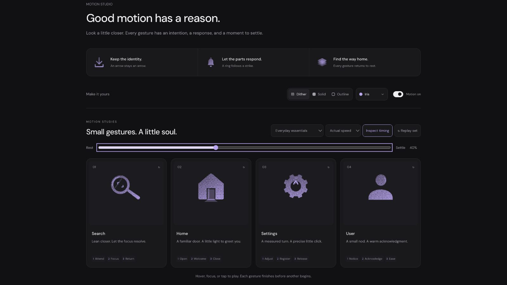

# Home: Interface Craft refinement 05

## Context
**Return to a familiar entry point.** `PlatformCommandPalette.tsx:82–88` maps its House icon to “Go home.” The glyph may welcome a visitor; navigation still belongs to the actual control.

## First Impressions
The previous doorway narrowed, but the interior light occupied the same strip as its moving leaf. The receiving threshold had no distinct response, so opening and returning looked almost equally empty.

## Visual Design
A fixed pitched roof and two continuous walls frame a wider doorway. The leaf has a quieter material, a small handle and deliberate jamb clearance. At rest, the house remains recognizable. A short floor plane appears only as light reaches the sill. Outline uses one house contour rather than tracing both sides of a thick filled wall.

## Interface Design
A short hinge preparation precedes opening. The entire left edge stays at x=9.65; scale and skew act perpendicular to that hinge. The leaf's full knockout uses identical frames and easing so interior light cannot show through it. The sill answers first, then light spreads onto the doorstep. Light clears before the leaf closes; the roof never moves.

## Consistency & Conventions
MOT-01/02/03/04/05/07/08/09/10/11/12/13/14/15/16. Existing React completion and standalone CSS export remain shared. Keep native navigation labels and targets under UI-4, A11Y-2 and MOTION-6/7 when integrated into the platform.

## User Context
The moving door stays subordinate to the familiar house. It does not depict a session ending, unlock protected content, or relocate the actual page. Frequent navigation can use its still version.

## Top Opportunities
1. Make opening reveal real space behind an occluding leaf.
2. Give that opening a visible threshold response and a short, restrained spill.
3. Preserve both hinge endpoints, including the bottom attachment during skew.

## Encoded storyboard and review
[home.ts](../../src/motions/home.ts) owns the source. Duration **1400ms**; stages **Open / Welcome / Close**.

- 120ms: hinge takes up pressure; 420ms: leaf open.
- 480ms: sill light; 560ms: doorstep light peaks.
- 730ms: hold ends; 890ms: light gone.
- 1200ms: leaf closed; 1400ms: exact rest.

The 35% browser frame shows the revealed sill; 40% shows light spreading onto the floor. At 70%, light is gone and the leaf is returning. Light Cobalt solid separates the leaf, opening and floor. Outline retains the same occlusion and hinge. Tests verify both hinge endpoints and exact leaf/knockout clocks. Actual/half-speed and keyboard-departure playback completed.

[Rest](../motion-evidence/refinement-05/pose-0.png) · [Light solid](../motion-evidence/refinement-05/light-cobalt-solid.png) · [Recovery](../motion-evidence/refinement-05/pose-70.png) · [Shared validation](../VALIDATION.md#focused-refinement-05--2026-09-10)
