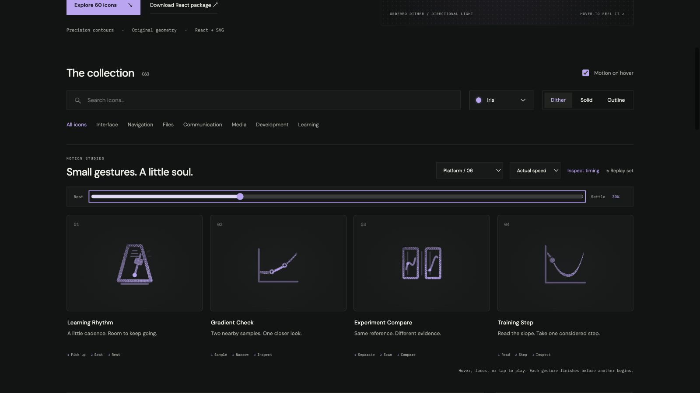

# Learning Rhythm: Interface Craft review

## Context

**Keep a measured learning cadence.** Settings names Learning rhythm and a Daily goal in `app/src/routes/settings.tsx:184–204`.

## First Impressions

A metronome gives cadence a physical identity. Its stable tapered case should read before the fine pendulum details.

## Visual Design

A tapered frame, one rigid weighted pendulum and a fixed low pivot. Keep open space around the moving weight. The grain belongs to the case and the weight.

**Identity boundary:** The entire stem and weight remain rigidly connected to the fixed pivot. The case never rocks.

## Interface Design

Pendulum takes a short pickup, crosses the stationary scale, then reverses at the measured beat. A small weight highlight and nearby bezel ticks answer that reversal. Return once and stop.

## Consistency & Conventions

MOT-01/02/03/05 preserve semantics, identity and a causal physical relationship. MOT-07/08/16 require stable grain and a localized response. MOT-09–15 bind full playback, exact rest, input/stillness, shared export timing and individual rendered review. Platform handoff: UI-2/4, COLOR-2/5, A11Y-2/4 and MOTION-1/4/6/7.

## User Context

A metronome has a reason to swing; it must not become a recurring attention demand. The preview neither starts a timer nor changes the Daily goal. Use native labeled controls. Prefer still 24px solid/outline for frequent actions and dither at 48px or larger. Keep keyboard, reduced motion and motion-off useful.

## Top Opportunities

Make the beat a precise local event; let recovery be quieter than the crossing.

## Encoded storyboard and review

**Pick up / Beat / Rest · 1460ms.** [learning-rhythm.ts](../../src/motions/learning-rhythm.ts) records the timestamp storyboard, commented clock and named actors. [LearningPracticeArtwork.tsx](../../src/LearningPracticeArtwork.tsx) owns the original geometry.

| Actor | Key times and attachment |
| --- | --- |
| Weighted pendulum | Static −12° attitude about (12,17.8); relative pickup −4° at 130ms; far beat +28° at 430ms; return 830ms; small +1.5° recovery 970ms; exact home 1240ms |
| Weight glint | Nested inside the rigid pendulum; peaks 500ms, clears 730ms |
| Bezel ticks | Fixed near the far reversal; peak 500ms, clear 730ms |

The static SVG contains the resting tilt; the motion track starts at zero. The upper stem was shortened to keep its crossing clear of the case, and filled stem segments stop beneath the weight to avoid doubled grain. The case stays grounded while the stem and weight sweep as one rigid object. This finite measure is the subject-specific MOT-06 exception; it does not allow a recurring swing.

Actual and half-speed sequences inspected through recovery. Eight poses at 0/10/30/44/54/60/84/100% return exactly. Dark Iris dither/outline and light Cobalt solid preserve the same inspected 60% pose. Keyboard departure, disabled motion, reduced motion, 390px layout, 24px solid and 64px dither were reviewed. The standalone SVG rest board was also rendered without JavaScript. See [batch validation](../VALIDATION.md) for evidence and limits.

**Reference position: 1 of four.**

[Rest](../motion-evidence/platform-06/pose-0.png) · [Outline](../motion-evidence/platform-06/outline-60.png) · [Light solid](../motion-evidence/platform-06/light-solid-60.png) · [Static export board](../motion-evidence/platform-06/static.svg)

