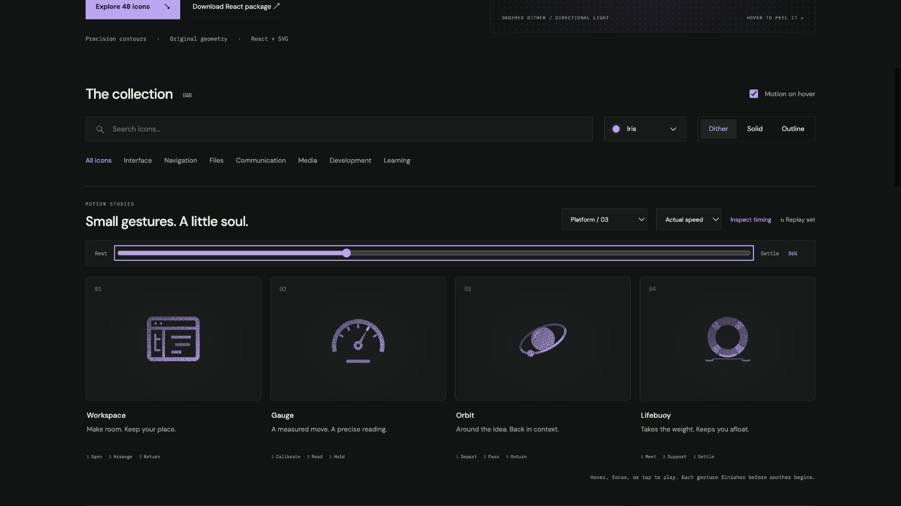

# lifebuoy: Interface Craft review

## Context

**Accept a load and keep it supported.** CraftingAttention's command palette uses LifeBuoy for Support. This familiar rescue ring identifies help; it does not send a request or promise that someone has responded.

## First Impressions

The ring's open center and four diagonal wraps establish a lifebuoy. A faint fixed waterline gives its small vertical movement a physical reference. The ring meets that line before the contact catch and outward ripples appear.

## Visual Design

The base ring and wraps use different ink densities. Wrap occlusion prevents double grain. All four wraps and the central aperture move rigidly with the body. The first outline pass had eight busy seam ends; four clean radial straps now join its circular boundaries instead.

**Identity boundary:** The central rescue aperture stays open, all wraps remain attached, and the ring never deforms into a solid disk. The fixed waterline does not follow the buoy.

## Interface Design

The body lifts slightly, then descends to meet the waterline at 410ms. Buoyancy holds its lower edge at the same height while the residual tilt unwinds. A light catches on the contact arc; displaced water sends two ripples outward, followed by finer lower echoes. The body rises and settles while that response dissipates.

## Consistency & Conventions

MOT-01/03/05 protect the aperture, attached wraps, and receiving line. Under MOT-06, the small rigid body movement describes buoyancy against a visible support surface. MOT-08/16 require contact before ripples. MOT-09–15 keep the common lifecycle, exact return, stillness, and shared export. Platform handoff: UI-2/4, COLOR-2/5, A11Y-2/4, MOTION-1/4/6/7.

## User Context

A Learner opening Support may be frustrated or blocked. The gesture should feel steady and available, never alarmed or demanding. Use a still compact glyph for frequent navigation. Any actual support action needs its own control label and real status.

## Top Opportunities

1. Establish a visible receiving surface before introducing a bounce.
2. Begin the response at the ring's actual point of contact.
3. Keep the four straps clear in every material and at small sizes.

## Encoded storyboard and review

**Meet / Support / Settle · 1460ms**. Source: [lifebuoy.ts](../../src/motions/lifebuoy.ts).

| Actor / origin | Key times (ms) |
| --- | --- |
| `buoy` / 12,10.8 | 150 lift; 410 contact; 495 resist; 760 rise; 1120 home |
| `buoy-contact` / 12,18.15, inside body | 410 start; 495 peak; 960 clear |
| `ripple-left/right` / 6.4,20.1 and 17.6,20.1 | 410 start; 580 peak; 960 clear |
| `echo-left/right` / 7.2,22 and 16.8,22 | 495 start; 760 peak; 960 clear |

Every actor begins at 0 and ends at 1460ms. Actual/half-speed playback and eight poses show contact before the exterior response. The 36% frame makes the held waterline contact clear; 58% shows the dissipating echoes. The refined outline is less busy; light solid retains the four-band silhouette. Verified exact endpoints, material continuity, keyboard completion, reduced motion, motion-off, compact sizes, and 390px layout. See [validation](../VALIDATION.md).

**Reference position: 4 of four.**

[Preparation](../motion-evidence/platform-03/pose-10.png) · [Ripples](../motion-evidence/platform-03/pose-45.png) · [Outline straps](../motion-evidence/platform-03/outline-36.png) · [64px dither](../motion-evidence/platform-03/collection-dither-64.png)
