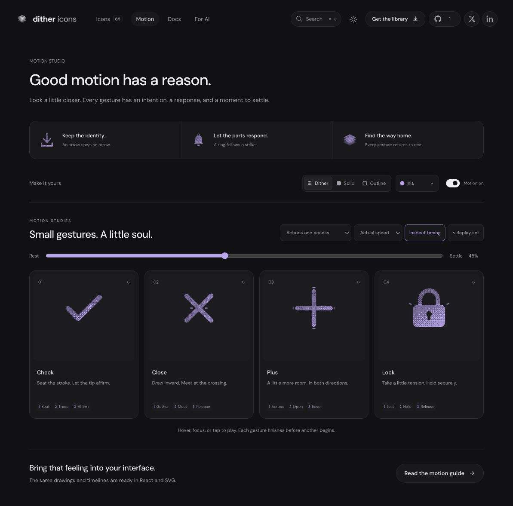

# Lock: Interface Craft refinement 06

## Context
**Indicate protected access that holds.** The platform has a LockKeyhole in `components/auth/AuthEntryPage.tsx:50` and read-only lock indicators in `components/lab/SplitEditor.tsx:108`. This preview cannot claim authentication or unlock anything.

## First Impressions
The earlier shackle took tension but its receiving body was a sharp, heavy rectangle. The shoulder light lacked a clearly visible exterior response. Protection needs a stable housing and a sustained hold, not an opening animation.

## Visual Design
A round-crowned shackle enters a housing with 2.2-unit corner radii. The keyhole stays unchanged. A fixed housing mask removes the hidden portion of the shackle, preventing double ink in dither. Outline uses a 1.8-unit shackle and a 1.3-unit housing stroke; its compact keyhole is filled for legibility. Two shoulder glints sit on the receiving top edge, followed by fine exterior resistance marks.

## Interface Design
The shackle scales only vertically about its drawn foot line at y=11.3. Both feet remain fixed behind the body while its crown rises under 5.5% tension. At 360ms the tension holds; shoulder glints peak at 430ms and exterior marks at 500ms. Release begins after 610ms, with a small seating compression and a slow final rest. The body and keyhole never move.

## Consistency & Conventions
MOT-01/03/05/06/07/08/09/10/11/12/13/14/15/16. Preserve closed-lock identity throughout; response follows resistance at actual attachment points. An unchanged host state never becomes a fabricated unlock or permission grant.

## User Context
The emotional quality is reassurance through stability. The maintained hold matters more than distance traveled. At 24px the open space under the crown and the recognizable keyhole remain clear, including without motion.

## Top Opportunities
1. Keep the entire foot line seated beneath a fixed housing.
2. Refine the housing and keyhole for compact reading.
3. Answer tension at both receiving shoulders, then release quietly.

## Encoded storyboard and rendered review
[lock.ts](../../src/motions/lock.ts), **1240ms**, **Test / Hold / Release**.

```text
0       120        360 430 500       610       780       1000   1240
rest -- gather --- tension--light--echo--hold--seat ----- home --- rest
feet + body + keyhole: fixed ---------------------------------- fixed
```

Reviewed 10% preparation, 28% approach to tension, 40/45% shoulder response, 62% seating and 100% rest. Browser views show no opening or detached feet in dither, solid or outline. Tests derive the anchor from the drawn shackle foot and compare it with the housing top. Actual/half-speed, keyboard departure and reduced motion passed.



[Rest](../motion-evidence/refinement-06/pose-0.png) · [Small sizes](../motion-evidence/refinement-06/size-and-export.png) · [Batch validation](../VALIDATION.md#focused-refinement-06--2026-09-10)
