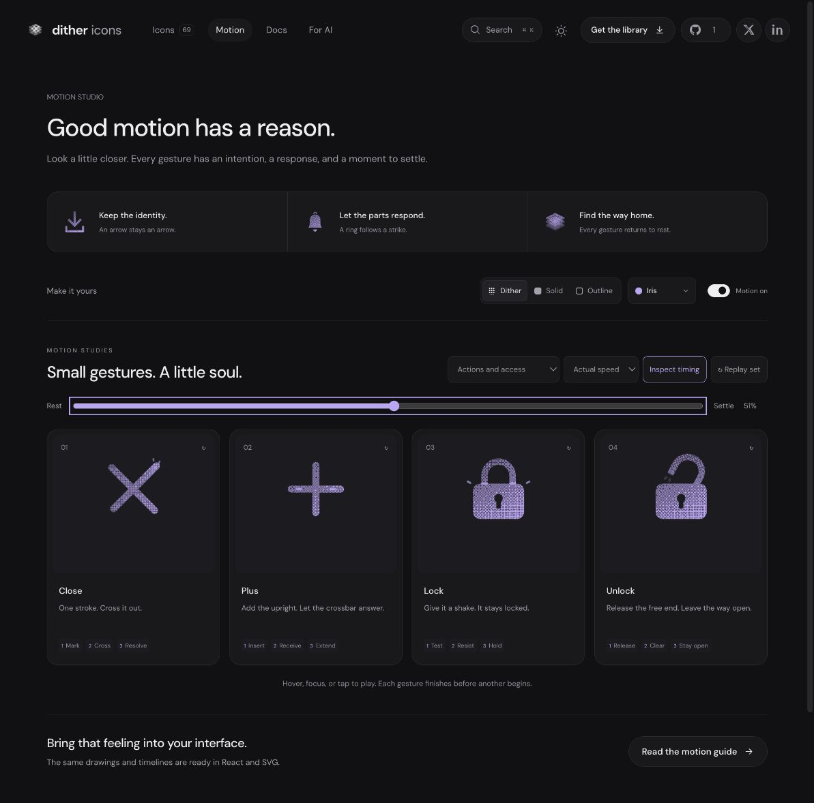

# Lock: resistance shake refinement

## Context
**Indicate access that remains locked.** The user asked for a shake to emphasize that it cannot be opened. AuthEntryPage and SplitEditor's read-only indicators remain the relevant platform contexts; the host controls actual permissions.

## First Impressions
The prior upward tension was too polite to communicate refusal. Stretching the crown also softened the impression of a rigid mechanism. Keep the accepted drawing, but replace stretch with a short rattle that runs out of travel against the fixed housing.

## Visual Design
The rounded housing and keyhole stay planted. The entire shackle translates as one rigid piece; no skew, stretch or tilt. A .25-unit upward tug leaves both full-width feet beneath the housing's rounded shoulders. Sideways travel peaks at .72 units and rapidly diminishes. The existing housing mask preserves insertion in dither, solid and outline. The same shoulder glints and exterior marks answer the final arrest.

## Interface Design
Tug at 110ms, first right stop at 185ms, opposite stop at 245ms, then three shorter reversals at 305/360/405ms. Center firmly at 450ms. Shoulder light peaks at 495ms and exterior response at 550ms. Hold the stopped pose through 680ms before lowering the tiny tug. Return to the original closed pose at 850ms; end at 1080ms. That deliberate stillness makes resistance the conclusion.

## Consistency & Conventions
MOT-01/03/04/05/06/07/08/09/10/11/12/13/14/15/16. This shake has a specific physical relationship: the shackle tests its retained travel, while the body refuses to yield. It does not bounce the whole icon or imply an unlock, actual security guarantee, or access change. Native playback and standalone SVG share the timeline; CSS hover still stops on pointer departure.

## User Context
A brief refusal should be clear without feeling angry or distracting. The rattle occupies 340ms after the initial tug and ends decisively. Reduced motion retains the complete closed glyph. [Unlock](unlock.md) keeps its separate open resting state and unchanged motion.

## Top Opportunities
1. Show resistance through constrained rigid travel instead of elastic stretching.
2. Keep both shackle feet captured behind a motionless housing throughout.
3. Follow the rattle with a firm stop, localized response and sustained stillness.

## Encoded storyboard and rendered review
[lock.ts](../../src/motions/lock.ts), **1080ms**, **Test / Resist / Hold**.

```text
0     110  185 245 305 360 405 450 495 550      680     850     1080
rest--tug--right-left--right-left--right-stop--response--hold--home--rest
housing + keyhole: fixed; shackle feet remain inserted throughout
```

[Evidence](../motion-evidence/lock-resistance/) supersedes the tension-only performance. At the inspected 17% and 23% extremes, both feet remain visibly beneath the housing and the crown keeps its original proportions. At 42% it is centered and stopped; the delayed response is visible at 51%. Start/end part poses match exactly. Live actual/half-speed replay completes after keyboard departure. Material switches preserve the inspected transform. Geometry tests check the drawn feet's full width against the rounded housing, alternating diminishing travel and the post-rattle hold.


