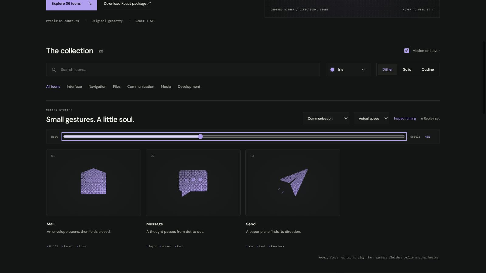

# mail: Interface Craft review

## Context
An SVG action icon in a reusable developer library. Its semantic meaning is **an envelope containing correspondence**. It appears in routine controls where recognition matters more than spectacle.

## First Impressions
Lifting a flat triangle is not a convincing hinged flap.

## Visual Design
**Identity boundary** — Envelope body stays fixed while the flap remains attached. Stable dither follows the contour. Color inherits the selected palette; accents use the same ink and stay below the primary silhouette in visual weight. Typography and card framing belong to the shared inspector, not the glyph.

## Interface Design
The missed opportunity is to express **an envelope containing correspondence** through a causal gesture. Rotate the flap in its own plane by flattening then opening around the top fold; reveal a paper edge and close. The inspector exposes replay and timing only when requested; the icon itself adds no controls or labels.

## Consistency & Conventions
Retain the conventional glyph. Use the shared hover, focus, click, reduced-motion, and completion contracts. MOT-01, MOT-02, MOT-03, MOT-04, MOT-05, MOT-08, MOT-09, MOT-10, MOT-11, MOT-12, MOT-14, MOT-15 apply.

## User Context
Avoid an outgoing flight, which belongs to send. Recognizability must survive a brief glance and the still-motion variant.

## Top Opportunities
1. Rotate the flap in its own plane by flattening then opening around the top fold; reveal a paper edge and close.
2. Envelope body stays fixed while the flap remains attached.
3. Avoid an outgoing flight, which belongs to send.

## Encoded storyboard and review

**Duration:** 1140ms. **Sequence:** Unfold / Reveal / Close.

Timing source: [communication.ts](../../src/motions/communication.ts). Geometry binds each named track in `CraftedArtwork.tsx` or `ExtendedArtwork.tsx`. Times below are milliseconds from the same clock; transform values, pivots and easing live in that source.

| Named part | Keyframe times (ms) |
| --- | --- |
| `flap` | 0, 130, 420, 680, 970, 1140 |
| `letter` | 0, 220, 460, 720, 940, 1140 |

**Rendered review:** The first open pose resembled a house. The corrected hinge join and envelope seams preserve its identity. Solid mode uses negative seams; dither retains the lighter crease treatment.

Reviewed at preparation (20%), action (40%), recovery (70%) and neutral endpoint (100%), with actual playback and per-part endpoint inspection in the live gallery. These samples establish the reviewed poses; they do not replace the full timeline or the shared lifecycle checks in [VALIDATION.md](../VALIDATION.md).

**Visual reference:** icon 1 from the left in this family.

[Preparation image](../motion-evidence/rollout/communication-prepare.png) · [Recovery image](../motion-evidence/rollout/communication-recover.png)
