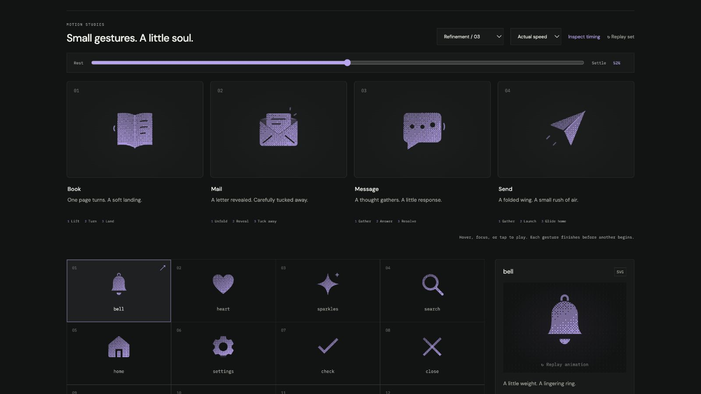

# message: Interface Craft refinement 03

## Context
**Meaning:** a short thought or conversational response. **Invariant:** a stable bubble, tail, and three legible dots. This is a finite preview gesture, not a live typing or unread-message indicator.

## First Impressions
The prior square dots shared the bubble's dither and became faint marks within the same grain. They lifted in succession, but the sequence had no final response. Recognition and payoff both needed work.

## Visual Design
Use round 2.1-unit dots. In dither and solid they are true negative apertures through the bubble; in outline they are filled circles. They remain clear in every material while sharing the same position and motion.

The last dot receives slightly greater emphasis. A fine line catches the nearby inner bubble edge, then one curved exterior echo grows outward. The bubble and tail themselves remain still, giving the dot motion a fixed reference. All accents use inherited ink and stay below the silhouette in visual weight.

## Interface Design
Pass one impulse from left to middle to right. Each dot gathers, rises, returns, and settles. The stronger last crest supplies the cause for the nearby edge response and the delayed exterior echo. There is one conversational beat and no repeated loader loop.

## Consistency & Conventions
MOT-01–16 apply. The material change relocates the dot groups between mask and visible SVG content; the existing runtime rebinds them and preserves inspected time. Recognition never depends on the exterior echo, and no incoming or successfully sent message is claimed.

## User Context
Conversation controls are used repeatedly. A restrained, finite response adds character without implying that another person is typing. The three dots remain useful at 24px and when motion is disabled. Keyboard departure preserves the performance instead of cutting it short.

## Top Opportunities addressed
1. Make all three dots clear against the dithered bubble.
2. Give the conversational sequence a stronger final beat.
3. Let a local edge response lead the exterior echo while the bubble stays fixed.

## Encoded storyboard
Source: [message.ts](../../src/motions/message.ts). `TIMING`, `MESSAGE_ART`, `DOT`, `EDGE`, `ECHO`, the three dot records, and `EASE` define the performance.

| Time | Action |
| --- | --- |
| 110 / 230 / 365ms | Left, middle, and right finish gathering. |
| 275 / 405ms | First two dots crest at −0.9 units and 117% scale. |
| 545ms | Final dot crests at −1.12 units and 124% scale. |
| 585ms | Adjacent inner edge catches the response. |
| 635ms | Exterior conversational echo reaches its crest. |
| 745–1000ms | Final dot returns; echo clears by 940ms. |
| 1180ms | Exact still dots and bubble. |

## Rendered review
The 25% pose shows the stagger; 40% shows the last dot building; 52% shows the edge and echo climax. Normal-speed playback reads as one finite response. Dither dots now retain their shape instead of blending into the field. Material switching at 52% kept their computed transforms, including the move from masked holes to visible outline dots.

[Preparation](../motion-evidence/refinement-03/prepare.png) · [Stagger](../motion-evidence/refinement-03/crossing.png) · [Light solid](../motion-evidence/refinement-03/solid-light.png) · [24px solid](../motion-evidence/refinement-03/compact-communication.png) · [Batch validation](../VALIDATION.md#focused-refinement-03--2026-09-09)
