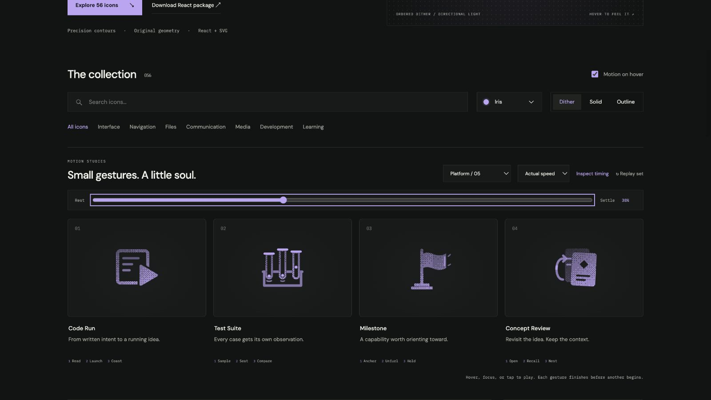

# Milestone: Interface Craft review

## Context

**Orient toward a capability on a Path.** `paths.universe.tsx:1661` labels an actual Milestone. This is a proposed semantic affordance for that existing surface; it does not certify achievement.

## First Impressions

An anchored flag is a destination marker. The pole and tiered foot keep it spatially grounded while a single fold travels outward.

## Visual Design

Two nested cloth panels share an entire vertical seam. Root skew/scale keeps the full pole attachment fixed; the free panel retains the full seam rather than pivoting at a single corner.

**Identity boundary:** The mast, foot, and connected flag remain present and joined at every interpolated pose.

## Interface Design

The root gathers, takes the pull, and passes it to the delayed free edge. Light runs along the free edge and two close air marks answer before the cloth quiets.

## Consistency & Conventions

MOT-01/02/03/05 preserve meaning, identity, and physical relationships. MOT-07/08/16 bind grain and light to the cause. MOT-09–15 require completed playback, exact rest, reduced-motion support, shared export timing, individual review, and no invented app result. Platform handoff: UI-2/4, COLOR-2/5, A11Y-2/4, MOTION-1/4/6/7.

## User Context

Use a native labeled control for keyboard and touch. Prefer still solid/outline at 24px for repeated actions, and dither at 48px or larger. Motion remains optional; disabled/reduced-motion controls retain their meaning. The library gesture does not change platform state.

## Top Opportunities

Validate whole attachment edges, not just a chosen pivot. The anchored identity prevents an arbitrary floating or celebratory flag.

## Encoded storyboard and review

**Anchor / Unfurl / Hold · 1420ms.** [milestone.ts](../../src/motions/milestone.ts) contains the timestamp storyboard, named actors and clock. [LearningWorkflowArtwork.tsx](../../src/LearningWorkflowArtwork.tsx) owns their original contours and instance-scoped masks.

1420ms total; gather 130; root pull 360; free panel crest 470; response 560; clear 760; quiet 1030. Root origin 9.5,8.5; seam origin 14,9.

Actual and half-speed playback reviewed. Eight reference poses return exactly; dither/outline/solid retain the same 52% transforms, origins and opacity. Keyboard departure, reduced motion, motion-off, 390px layout, 24px solid and 64px dither were inspected. Semantic name and use-case search verified. See [batch validation](../VALIDATION.md).

**Reference position: 3 of four.**

[Rest](../motion-evidence/platform-05/pose-0.png) · [Outline](../motion-evidence/platform-05/outline-52.png) · [Light solid](../motion-evidence/platform-05/light-solid-52.png) · [Compact silhouettes](../motion-evidence/platform-05/collection-24-solid.png)
