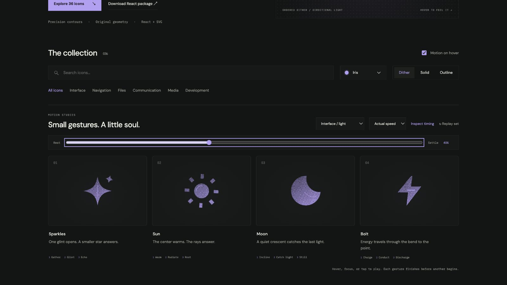

# moon: Interface Craft review

## Context
An SVG action icon in a reusable developer library. Its semantic meaning is **nighttime or a dark appearance**. It appears in routine controls where recognition matters more than spectacle.

## First Impressions
A generic wiggle makes a quiet symbol unnecessarily restless.

## Visual Design
**Identity boundary** — Crescent negative space is preserved. Stable dither follows the contour. Color inherits the selected palette; accents use the same ink and stay below the primary silhouette in visual weight. Typography and card framing belong to the shared inspector, not the glyph.

## Interface Design
The missed opportunity is to express **nighttime or a dark appearance** through a causal gesture. Crescent makes a small measured tilt; the lower inner rim catches a brief glint and settles. The inspector exposes replay and timing only when requested; the icon itself adds no controls or labels.

## Consistency & Conventions
Retain the conventional glyph. Use the shared hover, focus, click, reduced-motion, and completion contracts. MOT-01, MOT-02, MOT-03, MOT-04, MOT-05, MOT-08, MOT-09, MOT-10, MOT-11, MOT-12, MOT-14, MOT-15 apply.

## User Context
Quiet and sparse; no orbiting decoration. Recognizability must survive a brief glance and the still-motion variant.

## Top Opportunities
1. Crescent makes a small measured tilt; the lower inner rim catches a brief glint and settles.
2. Crescent negative space is preserved.
3. Quiet and sparse; no orbiting decoration.

## Encoded storyboard and review

**Duration:** 1300ms. **Sequence:** Incline / Catch light / Still.

Timing source: [atmosphere.ts](../../src/motions/atmosphere.ts). Geometry binds each named track in `CraftedArtwork.tsx` or `ExtendedArtwork.tsx`. Times below are milliseconds from the same clock; transform values, pivots and easing live in that source.

| Named part | Keyframe times (ms) |
| --- | --- |
| `crescent` | 0, 180, 510, 760, 1100, 1300 |
| `rim-light` | 0, 310, 590, 850, 1120, 1300 |

**Rendered review:** The crescent preserves its negative space through the quiet tilt. Its lower inner glint is brief and contained; no orbiting decoration was added.

Reviewed at preparation (20%), action (40%), recovery (70%) and neutral endpoint (100%), with actual playback and per-part endpoint inspection in the live gallery. These samples establish the reviewed poses; they do not replace the full timeline or the shared lifecycle checks in [VALIDATION.md](../VALIDATION.md).

**Visual reference:** icon 3 from the left in this family.

[Preparation image](../motion-evidence/rollout/light-prepare.png) · [Recovery image](../motion-evidence/rollout/light-recover.png)
