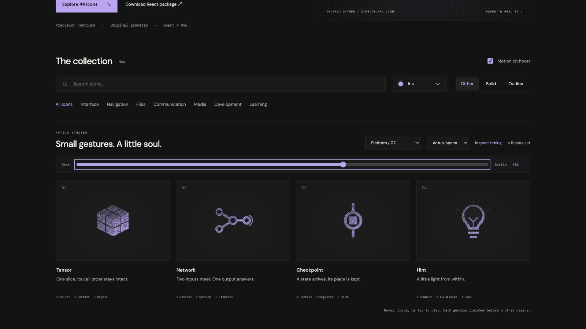

# network: Interface Craft review

## Context

**Combine connected inputs into an output.** The PyTorch sheet presents input × weight → prediction. This glyph identifies connected computation; it does not substitute for the sheet's numerical model, training sequence, or gradient explanation.

## First Impressions

Four ring nodes establish topology before anything moves. Two staggered signals converge on a slightly larger hub. A late output echo distinguishes the result from the incoming signals and makes the sequence feel resolved.

## Visual Design

Both diagonal carriers and the horizontal output remain fixed. Nodes have clear inner apertures. Moving hub/output cutouts share their visible rings' exact tracks, so connections meet the outer edge without showing through the center. The short exterior echo fits inside the viewBox, including stroke.

**Identity boundary:** Four nodes and three connections remain recognizable. Source nodes stay still. Signal displacement remains on the diagonal's 5:8 slope; the graph never rearranges itself.

## Interface Design

The upper signal arrives first. The hub waits for the lower signal before compressing to combine them. It then releases along the output connection. The receiving node expands slightly; its finer echo follows. No numerical result, successful Run, or learning achievement is implied.

## Consistency & Conventions

MOT-01/03/05 require fixed topology and causality. MOT-06/08/16 limit the response to the hub and receiving node. MOT-07/09–15 keep material, playback, export timing, and review consistent. Platform handoff uses UI-2/4, COLOR-2/5, A11Y-2/4, MOTION-1/4/6/7; full motion belongs to an optional invitation, not every computation tick.

## User Context

Network differs from CPU by expressing a relationship between inputs, computation, and output. Use 24px solid/outline in navigation and 48px+ dither in sheet entry points. Carrier highlights are subtle on solid ink; the topology and node response carry the meaning without them.

## Top Opportunities

1. Make combination contingent on both arrivals.
2. Keep light attached to its actual carrier.
3. Reserve the exterior echo for the receiving output.

## Encoded storyboard and review

**Receive / Combine / Transmit · 1380ms**. Source: [network.ts](../../src/motions/network.ts).

| Actor / origin | Key times (ms) |
| --- | --- |
| `upper-signal` / 6.1,8.3125 | 130 start; 260 light; 420 arrive; 505 clear |
| `lower-signal` / 6.1,15.6875 | 180 start; 310 light; 470 arrive; 555 clear |
| `compute-node`, `compute-occlusion` / 12,12 | wait 470; 525 combine; 610 release; 940 neutral |
| `output-signal` / 14.6,12 | 580 start; 740 light; 805 receive; 980 clear |
| `output-node`, `output-occlusion` / 20,12 | wait 805; 880 response; 1150 neutral |
| `output-echo` / 20,12 | 805 start; 880 peak; 1090 clear |

Every track starts at 0 and ends at 1380ms. Reviewed continuous actual/half speed and eight scrubbed poses. In the late 65% pose, the exterior echo reads at the output while input apertures stay quiet. All materials preserve the 45% inspected pose; endpoints match exactly. Checked 24px solid, 64px dither, keyboard departure, reduced motion, motion-off, and 390px layout. See [validation](../VALIDATION.md).

**Reference position: 2 of four.**

[Input preparation](../motion-evidence/platform-02/pose-10.png) · [Convergence](../motion-evidence/platform-02/pose-36.png) · [Outline](../motion-evidence/platform-02/outline-45.png)
