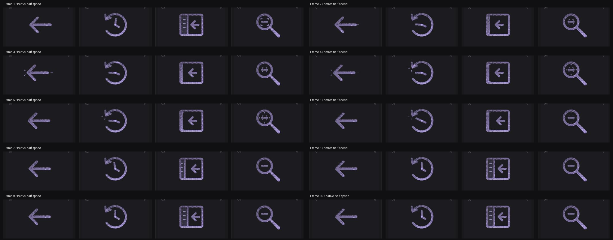

# Collapse Panel: Interface Craft review

## Context
Hide file explorer in the Lab Unit editor (`app/src/routes/lab.$slug.tsx:1669–1678`). This supplies the existing File Explorer icon with a truthful close affordance. The host already owns `explorerOpen`, `toggleExplorer`, its accessible label and aria-expanded.

## First Impressions
A visible drawer, fixed frame and inward arrow make the action concrete. The important difference from simply shrinking a rectangle is that real drawer contents must slide behind the boundary at their original size.

## Visual Design
The drawer and divider share the same translation; a fixed interior clip hides the moving rows behind the left frame. All three rows clear the clip at closure. A narrow retained rail keeps the left edge legible; the frame and arrow remain recognizable. Grain travels with the drawer.

## Interface Design
The arrow leads; the drawer follows. At 470ms the divider reaches x=4.95, where top and bottom latch marks appear after the stop. The collapsed arrangement holds before the preview restores itself. Drawer rows are never scaled or squeezed.

## Consistency & Conventions
MOT-01/03/05/07/08/15/16 guide identity, relationships, material and the semantic finish. MOT-09/10/11/12 preserve complete finite playback, exact rest, stillness and shared export timing. MOT-14 leaves application state to the host. Future platform use follows UI-2/4, COLOR-2/5, A11Y-2/4 and MOTION-1/4/6/7.

## User Context
The host alone collapses the real editor, immediately according to user input. This decorative gesture cannot replace aria-expanded, the Hide/Show label or content visibility. Use the close icon for the Hide action; the existing File Explorer covers Show.

## Top Opportunities
Occlude full-size contents; keep drawer and divider attached; locate the latch response on the actual closed rail.

## Encoded storyboard and review
[Timing source](../../src/motions/panel-left-close.ts). 1460ms. Arrow leads at 130ms; drawer starts at 210ms; full closure at 470ms; latch at 550ms; hold to 810ms; response clears by 1050ms; original drawer by 1290ms. Actors: panel-drawer, panel-divider, panel-arrow, panel-latch.

The rendered rows pass cleanly behind the frame instead of compressing. The rail remains in place during the hold and the response sits on that rail. Solid and outline retain the same occlusion and timing as dither. Reviewed seven poses, actual-speed keyboard completion, native half-speed playback, three materials, light Cobalt/dark Iris, reduced motion, motion off, narrow layout and compact standalone SVGs. [Evidence and limits](../motion-evidence/platform-09/README.md). Implementation and rendered review are complete; user acceptance is pending.

## Outline material correction — 2026-10-02

**Invariant and critique:** A framed sidebar and inward arrow remain distinct from return navigation. Outline the frame, divider and closing arrow while keeping the drawer and content in their own clipped region.

**Material rule:** Reuse the reader's 0.5-unit Outline edges and transparent cores. Fine text and small semantic dots stay readable. Applicable: MOT-01, MOT-03, MOT-07, MOT-10, MOT-11, MOT-12, MOT-13 and MOT-15.

**Storyboard retained:** Withdraw / Close / Latch, 1460ms. Authored tracks remain: `panel-drawer`, `panel-divider`, `panel-arrow`, `panel-latch`. This correction changes material, not the semantic action or timing.

**Rendered review:** [Before/after and compact review](../outline-audit/README.md#correction-evidence) plus [actual 50% browser pose](../outline-audit/browser/pose-50.png). The six inspected poses are 0%, 10%, 35%, 50%, 75% and 100%; actor binding, material-switch pose preservation, keyboard completion and stillness checks are recorded with that evidence. User visual approval remains pending. Standalone SVG retains the authored CSS tracks; CSS hover still ends on departure while React finishes its gesture.
