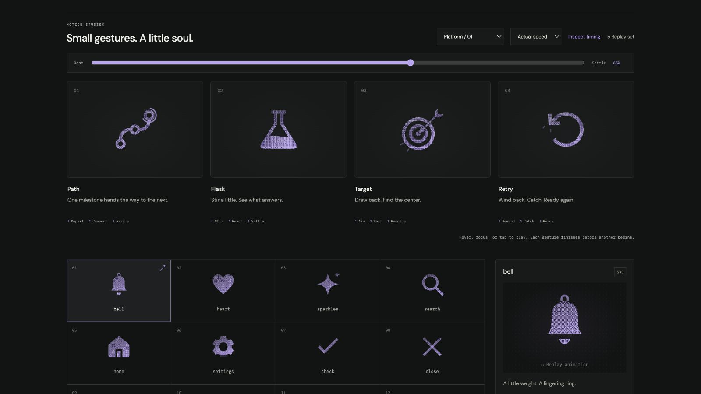

# path: Interface Craft review

## Context

New platform icon: **follow an ordered Path through Milestones**. Selected from observed CraftingAttention flows; see [PLATFORM-ICONS.md](../PLATFORM-ICONS.md).

## First Impressions

Path navigation in the command palette, dashboard, and onboarding currently uses Map icons. A generic map communicates location, but misses the ordered relationship between Milestones.

## Visual Design

Three ring nodes are joined by two smooth quarter turns. The carrier stays fixed while light follows its actual curvature. Each receiving node expands slightly only after arrival; the destination answers with a finer exterior halo.

## Interface Design

One signal travels from origin to middle, then from middle to destination. The middle receives before forwarding. The endpoint gets the strongest response; the complete path stays visible.

**Identity boundary:** Three connected nodes remain legible. The icon does not mark Units completed or change Progress.

## Consistency & Conventions

MOT-01–08 preserve identity, parts, stable references, and attached grain. MOT-09–13 bind completion, exact rest, reduced motion, common timing, and rendered verification. MOT-14–16 require truthful preview semantics, an individual review, and a perceptible causal climax. Platform handoff rules: UI-2, A11Y-2/4, COLOR-2, MOTION-1/6/7. The native parent supplies its real action and accessible name.

## User Context

The Learner may be concentrating on difficult work. Keep the glyph useful while still. Prefer solid or outline at 24px; use dither at 48px and larger. In high-frequency platform controls, use a still icon or short state feedback under MOTION-6; this full gesture is an optional invitation, never the sole state cue.

## Top Opportunities

1. Express **follow an ordered Path through Milestones** through the causal sequence above.
2. Preserve the listed identity boundary during every intermediate pose.
3. Keep the climax localized, then finish completely instead of looping.

## Encoded storyboard

**Depart / Connect / Arrive · 1380ms**

140ms depart; 420ms middle arrival; 485ms middle response; 510ms onward departure; 790ms destination; 905ms halo; 1380ms rest.

The timestamp storyboard and single `TIMING` object are in [path.ts](../../src/motions/path.ts). Geometry binds in [LearningArtwork.tsx](../../src/LearningArtwork.tsx). Native React, CSS export, and the inspector share these tracks.

| Named part | Keyframe times (ms) |
| --- | --- |
| `source-light` | 0, 70, 180, 440, 1380 |
| `route-first` | 0, 140, 265, 420, 505, 1380 |
| `middle-node` | 0, 420, 485, 620, 820, 1380 |
| `route-second` | 0, 510, 655, 790, 870, 1380 |
| `destination-node` | 0, 790, 850, 990, 1170, 1380 |
| `arrival-halo` | 0, 790, 905, 1120, 1380 |

## Rendered review

Reviewed at actual and half speed and at 0%, 10%, 28%, 36%, 45%, 65%, 82%, and 100%. Dark Iris dither/outline and light Cobalt solid preserve the silhouette and causal response. All computed parts match at 0% and 100%; paused material changes preserve the 45% pose. All four were inspected together at 24px solid and 64px dither. Keyboard departure completes, reduced motion is static, and motion-off disables playback. See [VALIDATION.md](../VALIDATION.md) for recorded evidence and limits.

**Reference position: 1 of four.**

[Rest](../motion-evidence/platform-01/pose-0.png) · [Preparation](../motion-evidence/platform-01/pose-10.png) · [Recovery](../motion-evidence/platform-01/pose-82.png) · [Outline](../motion-evidence/platform-01/outline-45.png) · [Light solid](../motion-evidence/platform-01/light-solid-45.png)
