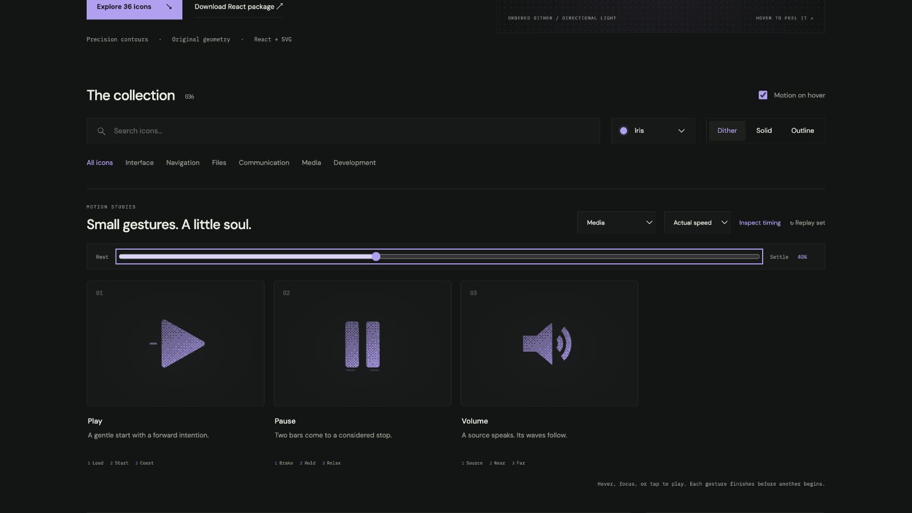

# pause: Interface Craft review

## Context
An SVG action icon in a reusable developer library. Its semantic meaning is **arrest motion and hold position**. It appears in routine controls where recognition matters more than spectacle.

## First Impressions
Pulsing both bars is ambiguous and can resemble loading.

## Visual Design
**Identity boundary** — Both vertical bars stay separate and visible. Stable dither follows the contour. Color inherits the selected palette; accents use the same ink and stay below the primary silhouette in visual weight. Typography and card framing belong to the shared inspector, not the glyph.

## Interface Design
The missed opportunity is to express **arrest motion and hold position** through a causal gesture. Two bars close toward their shared center with a small timing difference, settle into a short hold, then relax. The inspector exposes replay and timing only when requested; the icon itself adds no controls or labels.

## Consistency & Conventions
Retain the conventional glyph. Use the shared hover, focus, click, reduced-motion, and completion contracts. MOT-01, MOT-02, MOT-03, MOT-04, MOT-05, MOT-08, MOT-09, MOT-10, MOT-11, MOT-12, MOT-14, MOT-15 apply.

## User Context
The action should feel like braking, not starting. Recognizability must survive a brief glance and the still-motion variant.

## Top Opportunities
1. Two bars close toward their shared center with a small timing difference, settle into a short hold, then relax.
2. Both vertical bars stay separate and visible.
3. The action should feel like braking, not starting.

## Encoded storyboard and review

**Duration:** 840ms. **Sequence:** Brake / Hold / Relax.

Timing source: [media.ts](../../src/motions/media.ts). Geometry binds each named track in `CraftedArtwork.tsx` or `ExtendedArtwork.tsx`. Times below are milliseconds from the same clock; transform values, pivots and easing live in that source.

| Named part | Keyframe times (ms) |
| --- | --- |
| `bar-left` | 0, 100, 310, 500, 690, 840 |
| `bar-right` | 0, 150, 360, 530, 730, 840 |
| `seats` | 0, 230, 420, 650, 840 |

**Rendered review:** The two bars brake inward with a short stagger while keeping a clear gap. Their bases respond softly; the symbol never becomes play.

Reviewed at preparation (20%), action (40%), recovery (70%) and neutral endpoint (100%), with actual playback and per-part endpoint inspection in the live gallery. These samples establish the reviewed poses; they do not replace the full timeline or the shared lifecycle checks in [VALIDATION.md](../VALIDATION.md).

**Visual reference:** icon 2 from the left in this family.

[Preparation image](../motion-evidence/rollout/media-prepare.png) · [Recovery image](../motion-evidence/rollout/media-recover.png)
