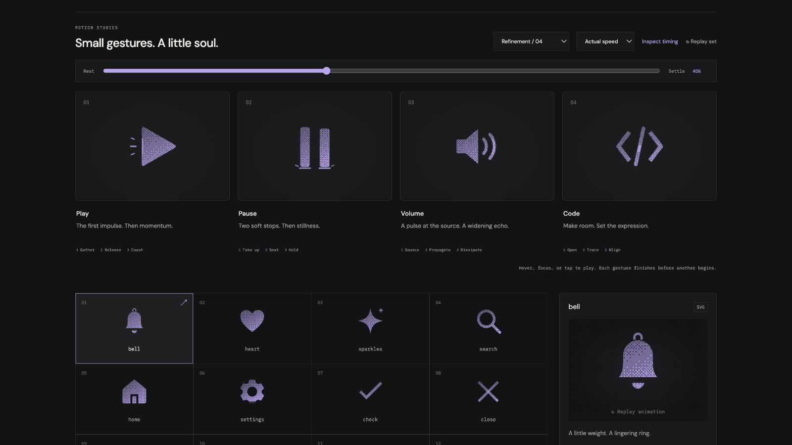

# play: Interface Craft review

## Context

A reusable SVG action icon. Its semantic meaning is **start forward progression**. This is one of the four icons in Refinement / 04; the report supersedes its initial broad-rollout review.

## First Impressions

The earlier triangle had direction, but its lone trailing hyphen made the release feel under-articulated. The onset and recovery had similar visual weight.

## Visual Design

The triangle now has softly resolved corners and enough inset for its forward stretch, including the outline stroke. Its full face remains visible. An attached rear-edge light makes the release belong to the material; three fine exterior strokes give the impulse a clear direction. Stable dither follows the triangle without a noise animation.

**Identity boundary:** One complete right-facing triangle throughout; no duplicate arrow, play/pause substitution, disappearance, or departure from the viewBox.

## Interface Design

Brief rearward pressure leads a decisive rightward release. The rear edge catches first, the short axial stroke follows, then two smaller pressure marks open behind it. The triangle continues forward a fraction while relaxing before coasting home. There is one onset and one dissipating wake.

## Consistency & Conventions

The shared gallery typography, palette, framing, inspector, and playback controls remain intact. Color is inherited. Dither, solid, and outline share named tracks. MOT-01–08 govern identity, geometry, material, and the causal response; MOT-09–13 govern completion, exact rest, accessibility, shared timing, and rendered verification; MOT-14–16 require truthful preview semantics, this individual review, and a legible climax.

## User Context

This is an invitation to start, not evidence that media is playing. In a toolbar the triangle carries meaning even when the accent strokes are too small to notice. Prefer solid or outline at 24px; dither benefits from 48px and above.

## Top Opportunities

1. Separate the quick release from its quieter coast.
2. Keep the strongest response at the broad releasing edge, followed by smaller exterior marks.
3. Reserve frame space for the moving outline and keep the triangle intact.

## Encoded storyboard

**Duration:** 970ms. **Sequence:** Gather / Release / Coast.

```text
0ms    Complete, still triangle
110ms  Rearward preload; a slight compression gathers pressure
300ms  Forward release; small horizontal stretch
325ms  Rear edge catches the release
345ms  Axial launch stroke peaks
390ms  Two smaller pressure marks open behind it
470ms  Continued forward coast while the shape relaxes
665ms  Exterior light has cleared
770ms  Subtle return correction
970ms  Exact neutral triangle
```

One named `TIMING` object and per-actor configuration live in [play.ts](../../src/motions/play.ts). Named SVG groups and local effect attachment live in [ControlArtwork.tsx](../../src/ControlArtwork.tsx). Native playback, inspection, and standalone CSS use the same tracks.

| Named part | Keyframe times (ms) |
| --- | --- |
| `triangle` | 0, 110, 300, 470, 770, 970 |
| `release-edge` | 0, 200, 325, 665, 970 |
| `launch-stroke` | 0, 245, 345, 665, 970 |
| `release-fan` | 0, 300, 390, 665, 970 |

## Rendered review

At 30–40% the rear edge and wake read as one release; they do not resemble a second play glyph. At 62% the wake is already faint while the triangle resolves home. Actual-speed and half-speed review preserve a distinct onset. The outline remains inside its frame. At 24px solid, the icon is recognizable independently of the response marks.

Reviewed in the live browser at actual and half speed, plus 0%, 10%, 30%, 40%, 50%, 62%, 82%, and 100%. All four icons have identical computed poses at the two neutral endpoints. Paused dither-to-outline switching at 40% preserves every named transform. Keyboard departure finishes the gesture. Reduced motion clears transforms and hides accents; motion-off disables study playback. See [VALIDATION.md](../VALIDATION.md) for the complete batch evidence and limits.

**Visual reference:** icon 1 from the left, in the new four-icon study group.



[Rest](../motion-evidence/refinement-04/pose-0.png) · [Preparation](../motion-evidence/refinement-04/pose-10.png) · [Recovery](../motion-evidence/refinement-04/pose-82.png) · [Outline](../motion-evidence/refinement-04/outline-40.png) · [Light solid](../motion-evidence/refinement-04/light-solid-62.png)
