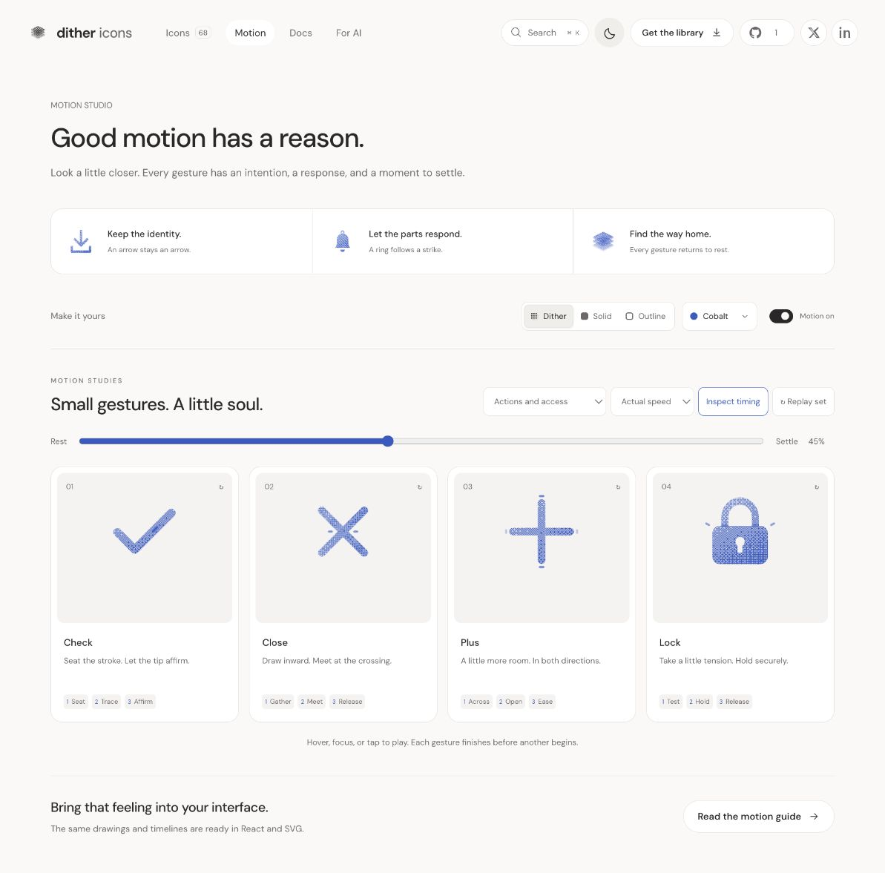

# Plus: Interface Craft refinement 06

## Context
**Add or make room.** The platform uses Plus for Start a discussion in `routes/discussions.$unitId.tsx:46` and Add in `components/lab/CustomUnitTestsPanel.tsx:125`. The library preview does not create an item.

## First Impressions
The earlier square-ended arms overlapped at their crossing. A single tip-light track followed both axes, blurring the order of their arrivals. Overshoot and recoil felt generic.

## Visual Design
Rounded 2.2-unit bands share a fixed orthogonal center. A matched vertical knockout removes duplicate grain and outline strokes. Four small endpoint marks belong to two independent pairs. They appear outside the maximum arm extents; no central ornament or rotation is introduced. At 24px, the same 1.8-unit outline centerlines remain legible.

## Interface Design
The horizontal arm opens first, reaching 110% at 300ms. Its endpoint marks peak at 365ms. The vertical arm arrives later at 430ms, with its own response at 495ms. Both hold at the added extent through 590ms and ease home without recoil. The stable intersection explains expansion; the stagger distinguishes two additions to the space.

## Consistency & Conventions
MOT-01/03/05/06/07/08/09/10/11/12/13/14/15/16. Each endpoint response waits for its carrier. The upper arm and knockout share all frames and easing, preserving the crossing between authored poses. Host controls own expansion and creation state.

## User Context
The gesture should suggest available space while keeping Plus unmistakable. It never turns into Close. At small size, exterior marks are subordinate to the four arms; the static icon is complete without them.

## Top Opportunities
1. Give each axis its own arrival and response.
2. Keep the crossing clean in all materials.
3. Return smoothly without springing the entire icon.

## Encoded storyboard and rendered review
[plus.ts](../../src/motions/plus.ts), **1100ms**, **Across / Open / Ease**.

```text
0       110 190     300 365     430 495      590      760     930 1100
rest -- gather ---- across--echo--above--echo--hold -- clear -- home--rest
center: fixed ------------------------------------------------ fixed
```

Reviewed 10% preparation, 28% horizontal arrival, 40/45% vertical arrival and response, 62/75% recovery and exact rest. The light-surface capture shows the separate endpoint responses. Tests verify each response follows its own arrival and the vertical knockout matches every frame. Material switching, both speeds, keyboard departure and reduced motion passed.



[Rest](../motion-evidence/refinement-06/pose-0.png) · [Small sizes](../motion-evidence/refinement-06/size-and-export.png) · [Batch validation](../VALIDATION.md#focused-refinement-06--2026-09-10)
