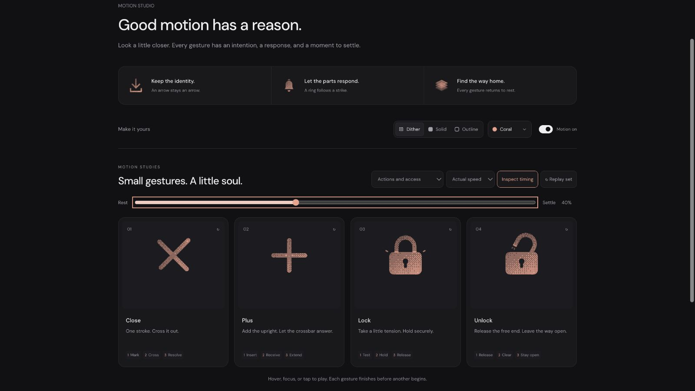

# Plus: semantic correction after refinement 06

## Context
**Add an item.** Plus appears in Start a discussion (`routes/discussions.$unitId.tsx:46`) and Add (`components/lab/CustomUnitTestsPanel.tsx:125`). The library expresses an addition gesture; the host creates the item.

## First Impressions
The user rejected the earlier two-axis expansion. Its stagger and endpoint effects did not give it a distinct action. The replacement needs an arriving part, a receiver and a response that travels from their meeting.

## Visual Design
Keep the complete rounded orthogonal crossing. The upright moves along its own axis; the crossbar stays still until arrival. Its upper-arm knockout has the exact same motion, so neither dither nor outline doubles at the center. Two short response segments move outward along the bar. Fine exterior tip marks conclude the travel.

## Interface Design
The upright lifts 1.8 units by 130ms, then inserts with a faster approach. The crossbar waits until 300ms, yielding only .25 units at the 340ms registration. Both centers share that displacement and return vertically together by 420ms. Light then travels from their intersection to both crossbar ends by 600ms. The endpoint finish peaks at 655ms, clears by 810ms, and the clock rests at 1080ms. The bar's 4% spread remains subordinate to insertion.

## Consistency & Conventions
MOT-01/03/05/07/08/09/10/11/12/13/14/15/16. Arrival precedes response; surface lights inherit the receiving bar's coordinate frame. The vertical arm stays full length and always intersects the bar, so Plus never becomes Minus or Close. The application owns creation and expansion state.

## User Context
One added stroke and a receiving response communicate addition with a small, readable movement. At compact sizes the complete Plus carries meaning even when its fine accents are not prominent.

## Top Opportunities
1. Give addition a specific arriving part and receiver.
2. Let the crossbar wait, receive, then carry the payoff outward.
3. Maintain the plus silhouette and avoid a whole-icon pulse.

## Encoded storyboard and rendered review
[plus.ts](../../src/motions/plus.ts), **1080ms**, **Insert / Receive / Extend**.

```text
0      130          300 340   420       600 655      810       1080
rest -- lift ------ wait--seat--flow---tips--finish--clear-----rest
bar: fixed until arrival; upright remains full length
```

[Current evidence](../motion-evidence/refinement-06-rework/) replaces the rejected expansion. Tests compare the upright and receiver at registration and release, matching knockout frames, and both response dependencies. Browser review includes live speeds, frame inspection, materials, light/dark, keyboard completion, stillness and small exports. User acceptance remains open.


