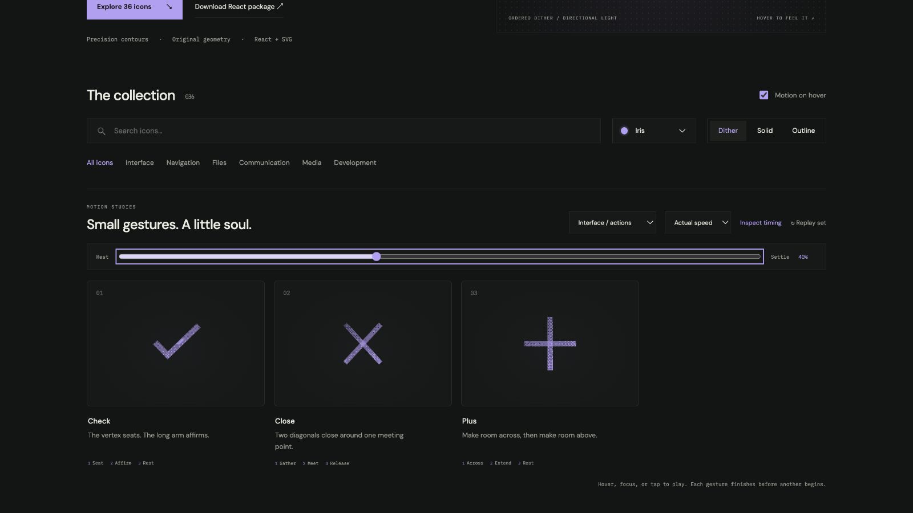

# plus: Interface Craft review

## Context
An SVG action icon in a reusable developer library. Its semantic meaning is **add or expand from a shared center**. It appears in routine controls where recognition matters more than spectacle.

## First Impressions
A generic pop does not respect the orthogonal arms.

## Visual Design
**Identity boundary** — The arms remain joined at a stable center. Stable dither follows the contour. Color inherits the selected palette; accents use the same ink and stay below the primary silhouette in visual weight. Typography and card framing belong to the shared inspector, not the glyph.

## Interface Design
The missed opportunity is to express **add or expand from a shared center** through a causal gesture. Horizontal arm makes room first, vertical arm follows, tips catch a brief emphasis, then return. The inspector exposes replay and timing only when requested; the icon itself adds no controls or labels.

## Consistency & Conventions
Retain the conventional glyph. Use the shared hover, focus, click, reduced-motion, and completion contracts. MOT-01, MOT-02, MOT-03, MOT-04, MOT-05, MOT-08, MOT-09, MOT-10, MOT-11, MOT-12, MOT-14, MOT-15 apply.

## User Context
Do not become a close mark or suggest a value increment. Recognizability must survive a brief glance and the still-motion variant.

## Top Opportunities
1. Horizontal arm makes room first, vertical arm follows, tips catch a brief emphasis, then return.
2. The arms remain joined at a stable center.
3. Do not become a close mark or suggest a value increment.

## Encoded storyboard and review

**Duration:** 840ms. **Sequence:** Across / Extend / Rest.

Timing source: [controls.ts](../../src/motions/controls.ts). Geometry binds each named track in `CraftedArtwork.tsx` or `ExtendedArtwork.tsx`. Times below are milliseconds from the same clock; transform values, pivots and easing live in that source.

| Named part | Keyframe times (ms) |
| --- | --- |
| `horizontal` | 0, 100, 290, 490, 690, 840 |
| `vertical` | 0, 90, 180, 390, 550, 750, 840 |
| `tip-light` | 0, 200, 420, 660, 840 |

**Rendered review:** The horizontal arm makes room before the vertical one. Both remain orthogonal and joined at the same center; the tip accent clears before rest.

Reviewed at preparation (20%), action (40%), recovery (70%) and neutral endpoint (100%), with actual playback and per-part endpoint inspection in the live gallery. These samples establish the reviewed poses; they do not replace the full timeline or the shared lifecycle checks in [VALIDATION.md](../VALIDATION.md).

**Visual reference:** icon 3 from the left in this family.

[Preparation image](../motion-evidence/rollout/actions-prepare.png) · [Recovery image](../motion-evidence/rollout/actions-recover.png)
