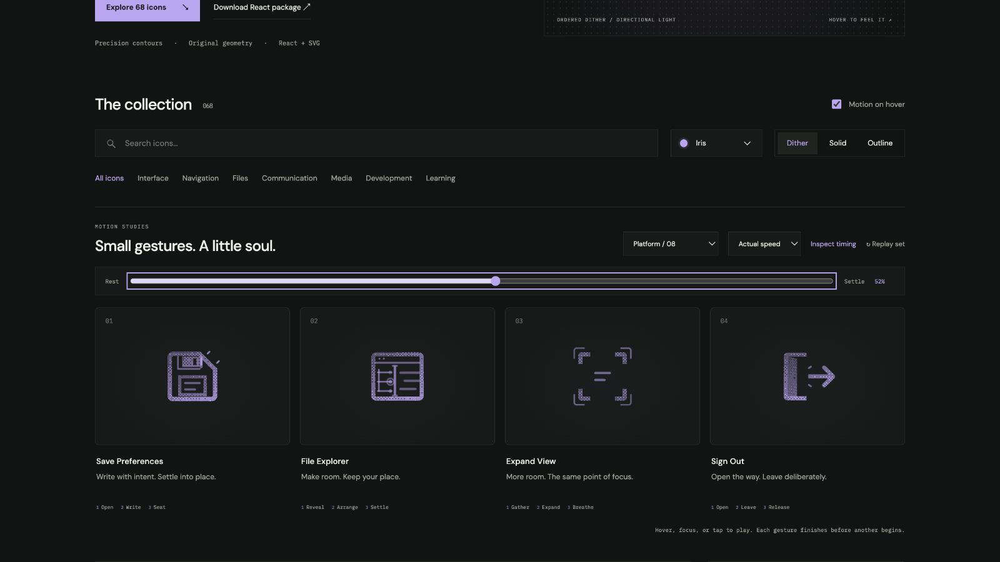

# Save Preferences: Interface Craft review

## Context

**Store deliberately edited preferences.** Actual platform call site: `settings.tsx:322–342` uses `SaveActionButton`; its idle/pending Save icon is in `components/ui/amicro/ActionMorph.tsx:244–251`.

## First Impressions

A fixed floppy housing and recessed write shutter make a familiar save affordance. The label must remain visible; a checkmark would falsely suggest persistence.

## Visual Design

**Identity boundary:** The complete disk, cut corner and label remain readable. The shutter does not cross its stop; the write traces never replace existing information.

## Interface Design

Open the shutter, let two write traces register within the existing label, then seat the shutter against its real stop. The stop gives a small late response.

## Consistency & Conventions

MOT-01/03/05 bind meaning, causal attachment and stable references. MOT-07/08/16 bind attached grain and a localized climax. MOT-09–15 bind completed playback, exact rest, keyboard, stillness, shared export timing and individual rendered review. Platform handoff: UI-2/4, COLOR-2/5, A11Y-2/4 and MOTION-1/4/6/7.

## User Context

Keep idle/pending/success/error owned by SaveActionButton. This study neither saves preferences nor certifies a successful save. Frequent compact controls should use still solid/outline, with their native target and accessible label. Use the full dither gesture for larger, infrequent entry points.

## Top Opportunities

1. Preserve the familiar control silhouette through every frame.
2. Stage the response after its physical cause, at the relevant part.
3. Keep the static variant and the real platform state authoritative.

## Encoded storyboard and review

**Open / Write / Seat · 1380ms.** [save-preferences.ts](../../src/motions/save-preferences.ts) records the timestamp storyboard and named actors; [PlatformActionsArtwork.tsx](../../src/PlatformActionsArtwork.tsx) owns the original drawing.

| Actor | Timing and attachment |
| --- | --- |
| Write shutter | Pickup 110ms; open −1.1px at 270ms; hold until 480ms; seat at 640ms |
| Retained label lines | Writing traces peak at 380 / 480ms, while shutter is open |
| Stop and corner witnesses | Peak 720ms after closure; clear 940ms |

The actual shutter edge x=14.5 meets the stop's left face x=14.5. Its other edge clears the channel at full opening. The first render put response marks against the cut corner, where solid fill would absorb them; the final pair sits just outside that diagonal. The disk housing and label stay fixed, and no success glyph appears.

Actual and half-speed sequences reviewed through recovery. Eight native poses at 0/10/24/34/46/52/82/100% have identical initial/final computed states. Dither, outline and solid retain the same 52% pose. Each icon was keyboard-replayed, allowed to finish after Tab departure, cancelled under reduced motion and disabled with motion off. Light/dark, 24px solid, 64px dither and a 390px two-column layout were inspected. See [batch validation](../VALIDATION.md) for evidence and limits.

**Reference position: 1 of four.**

[Rest](../motion-evidence/platform-08/pose-0.png) · [Outline](../motion-evidence/platform-08/outline-52.png) · [Light solid](../motion-evidence/platform-08/light-solid-52.png) · [Compact](../motion-evidence/platform-08/collection-solid-24.png)

## Outline material correction — 2026-10-02

**Invariant and critique:** The clipped-corner save shell retains its shutter and label. Open shell, label and shutter contour bands; the authored write receipts still precede shutter closure.

**Material rule:** Reuse the reader's 0.5-unit Outline edges and transparent cores. Fine text and small semantic dots stay readable. Applicable: MOT-01, MOT-03, MOT-07, MOT-10, MOT-11, MOT-12, MOT-13 and MOT-15.

**Storyboard retained:** Open / Write / Seat, 1380ms. Authored tracks remain: `save-shutter`, `save-write-0`, `save-write-1`, `save-stop`, `save-witness-upper`, `save-witness-lower`. This correction changes material, not the semantic action or timing.

**Rendered review:** [Before/after and compact review](../outline-audit/README.md#correction-evidence) plus [actual 50% browser pose](../outline-audit/browser/pose-50.png). The six inspected poses are 0%, 10%, 35%, 50%, 75% and 100%; actor binding, material-switch pose preservation, keyboard completion and stillness checks are recorded with that evidence. User visual approval remains pending. Standalone SVG retains the authored CSS tracks; CSS hover still ends on departure while React finishes its gesture.
