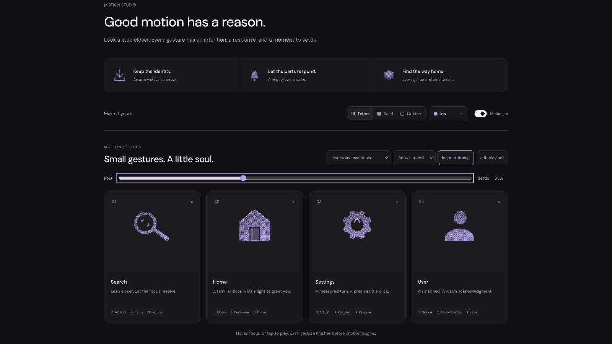

# Search: Interface Craft refinement 05

## Context
**Inspect or locate.** The platform command palette uses Search in `app/src/components/ui/CommandPalette.tsx:263`. This gesture suits the entry control; it must not repeat on each keystroke or imply a result was found.

## First Impressions
The previous rigid lean preserved recognition, but its single rim highlight was barely distinguishable from the dither. At the action frame there was no clear change in attention inside the lens.

## Visual Design
Keep the circular aperture, tapered handle and joined neck. The lens and handle now share one outer filled contour, preventing even-odd overlap from punching a hole in the joint. Outline uses a single lens centerline and a connected rounded handle. Two small focus brackets occupy the aperture; one faint glass reflection crosses behind them. The highlight follows the rim rather than washing over the icon.

## Interface Design
Take up weight at the handle, lean toward the subject, stop, and let two brackets concentrate into focus. The glass and rim respond after arrival. All optical actors belong to the rigid magnifier; the glass is clipped to its aperture. The silhouette carries the meaning without the accents. No result checkmark or fabricated search response appears.

## Consistency & Conventions
MOT-01/02/03/05/07/08/09/10/11/12/13/14/15/16. Named config and the existing shared native/CSS clock implement the storyboard. Platform integration follows UI-2/4 and MOTION-6/7: maintain the target and label; keep frequent input feedback still.

## User Context
At 24px use solid or outline; the 112px study reveals the optical details. Focus departure finishes the React gesture. Reduced motion clears the optics and leaves the complete magnifier.

## Top Opportunities
1. Give the inspection a definite focus moment inside its lens.
2. Keep the neck continuous in both filled and outlined drawings.
3. Reduce competing optical strokes: the final pass uses two brackets and one faint reflection.

## Encoded storyboard and review
[search.ts](../../src/motions/search.ts) owns the geometry, timing and pivots. Duration **1320ms**; stages **Attend / Focus / Return**.

- 0–120ms: prepare around the handle pivot (18.8, 18.8).
- 380ms: reach the inspection pose; hold through 700ms.
- 470ms: focus brackets register; 540ms: glass/rim response.
- 850ms: accents clear; 1160ms: tool is home; 1320ms: exact rest.

In the native browser, 28% catches the arriving tool, 35–40% resolves the brackets and reflection, 70% shows the returning tool with no optical residue. The first drawing joined separate filled contours; source review found their even-odd overlap could cut the neck, so the final silhouette is continuous. Material switching at 40% preserved all actor transforms/origins/opacities. Keyboard departure and actual/half-speed playback completed.

[Rest](../motion-evidence/refinement-05/pose-0.png) · [Recovery](../motion-evidence/refinement-05/pose-70.png) · [Outline](../motion-evidence/refinement-05/outline-40.png) · [Shared validation](../VALIDATION.md#focused-refinement-05--2026-09-10)
