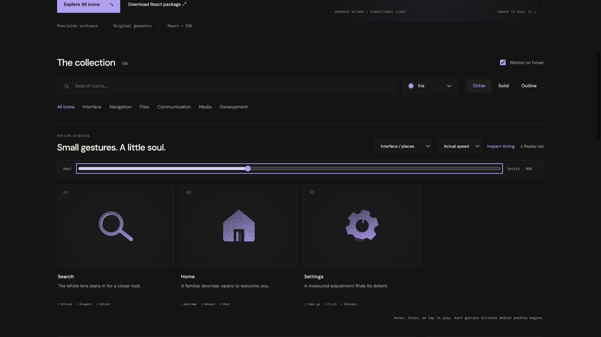

# search: Interface Craft review

## Context
An SVG action icon in a reusable developer library. Its semantic meaning is **inspect or locate something**. It appears in routine controls where recognition matters more than spectacle.

## First Impressions
A disconnected lens and handle can look broken during motion.

## Visual Design
**Identity boundary** — Closed lens and attached handle stay intact. Stable dither follows the contour. Color inherits the selected palette; accents use the same ink and stay below the primary silhouette in visual weight. Typography and card framing belong to the shared inspector, not the glyph.

## Interface Design
The missed opportunity is to express **inspect or locate something** through a causal gesture. Keep lens and handle rigidly connected, lean the tool toward a target, then sweep a small lens highlight. The inspector exposes replay and timing only when requested; the icon itself adds no controls or labels.

## Consistency & Conventions
Retain the conventional glyph. Use the shared hover, focus, click, reduced-motion, and completion contracts. MOT-01, MOT-02, MOT-03, MOT-04, MOT-05, MOT-08, MOT-09, MOT-10, MOT-11, MOT-12, MOT-14, MOT-15 apply.

## User Context
No endless scan: this is a deliberate inspection. Recognizability must survive a brief glance and the still-motion variant.

## Top Opportunities
1. Keep lens and handle rigidly connected, lean the tool toward a target, then sweep a small lens highlight.
2. Closed lens and attached handle stay intact.
3. No endless scan: this is a deliberate inspection.

## Encoded storyboard and review

**Duration:** 1180ms. **Sequence:** Attend / Inspect / Return.

Timing source: [controls.ts](../../src/motions/controls.ts). Geometry binds each named track in `CraftedArtwork.tsx` or `ExtendedArtwork.tsx`. Times below are milliseconds from the same clock; transform values, pivots and easing live in that source.

| Named part | Keyframe times (ms) |
| --- | --- |
| `magnifier` | 0, 150, 440, 680, 990, 1180 |
| `lens-light` | 0, 290, 470, 750, 980, 1180 |

**Rendered review:** The old handle had a small geometric gap. The corrected handle joins the lens, and both now move rigidly together; the lens highlight follows their lean.

Reviewed at preparation (20%), action (40%), recovery (70%) and neutral endpoint (100%), with actual playback and per-part endpoint inspection in the live gallery. These samples establish the reviewed poses; they do not replace the full timeline or the shared lifecycle checks in [VALIDATION.md](../VALIDATION.md).

**Visual reference:** icon 1 from the left in this family.

[Preparation image](../motion-evidence/rollout/places-prepare.png) · [Recovery image](../motion-evidence/rollout/places-recover.png)
